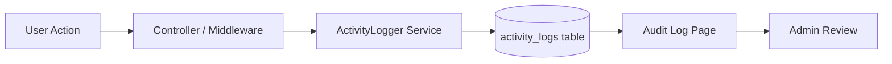

# 🛡️ Rancangan Fitur Audit Trail — SIMPATIK

## Tujuan

Mencatat **semua aktivitas pengguna** di sistem untuk:
1. **Deteksi Bug** — Trace langkah-langkah sebelum error terjadi
2. **Deteksi Serangan** — Login gagal berulang, akses tidak wajar, perubahan data mencurigakan
3. **Audit Compliance** — Bukti siapa melakukan apa, kapan, dari mana (penting untuk bank)

---

## Arsitektur



---

## 1. Database Schema

### Tabel `activity_logs`

| Kolom | Tipe | Keterangan |
|---|---|---|
| `id` | bigint PK | Auto increment |
| `user_id` | bigint nullable FK | User yang melakukan aksi (null = guest/system) |
| `action` | string(50) | Kode aksi: `login`, `logout`, `create`, `update`, `delete`, `approve`, `reject`, dll |
| `module` | string(50) | Modul terkait: `auth`, `user`, `item`, `inbound`, `outbound`, `category`, `department`, `setting` |
| `description` | text | Deskripsi aksi dalam bahasa Indonesia |
| `subject_type` | string nullable | Model class (polymorphic): `App\Models\User`, `App\Models\Item`, dll |
| `subject_id` | bigint nullable | ID dari record yang diubah |
| `old_values` | json nullable | Snapshot data **sebelum** perubahan |
| `new_values` | json nullable | Snapshot data **setelah** perubahan |
| `ip_address` | string(45) | IP address user |
| `user_agent` | text nullable | Browser/device info |
| `severity` | enum | `info`, `warning`, `danger` |
| `created_at` | timestamp | Waktu aksi |

> [!NOTE]
> `old_values` dan `new_values` disimpan sebagai JSON agar bisa diff perubahan field-by-field.

---

## 2. Event yang Dicatat

### 🔐 Auth (severity: warning/danger)

| Aksi | Severity | Contoh Description |
|---|---|---|
| `login` | info | "Rudi Hartono berhasil login" |
| `login_failed` | warning | "Percobaan login gagal untuk email admin@test.com" |
| `logout` | info | "Rudi Hartono logout" |
| `login_blocked` | danger | "Akun admin@test.com diblokir — 5x gagal login" |

### 👤 User Management (severity: info/warning)

| Aksi | Severity | Contoh |
|---|---|---|
| `create` | info | "User baru 'Andi Setiawan' dibuat oleh Rudi Hartono" |
| `update` | info | "Data user 'Andi' diperbarui: role staff → division_head" |
| `delete` | warning | "User 'Andi Setiawan' dihapus oleh Rudi Hartono" |
| `toggle_status` | warning | "User 'Andi' dinonaktifkan oleh Rudi Hartono" |

### 📦 Transaksi (severity: info)

| Aksi | Module | Contoh |
|---|---|---|
| `create` | inbound | "Barang masuk INB-202604-0001 dibuat (5 item, total Rp2.500.000)" |
| `create` | outbound | "Pengajuan SPB-202604-0001 dibuat oleh Siti Aminah" |
| `approve` | outbound | "Pengajuan SPB-202604-0001 disetujui oleh Bambang (Penyelia)" |
| `reject` | outbound | "Pengajuan SPB-202604-0001 ditolak — alasan: stok tidak cukup" |
| `issue` | outbound | "Pengajuan SPB-202604-0001 diserahkan oleh Rudi Hartono" |

### ⚙️ Settings & Master Data (severity: info)

| Aksi | Module | Contoh |
|---|---|---|
| `update` | setting | "Pengaturan diperbarui: company_name, wa_api_url" |
| `create` | category | "Kategori 'Alat Tulis' dibuat" |
| `delete` | department | "Unit Kerja 'Pemasaran' dihapus" |

---

## 3. Backend — File yang Dibuat/Dimodifikasi

### File Baru

| File | Keterangan |
|---|---|
| `database/migrations/xxxx_create_activity_logs_table.php` | Migration tabel |
| `app/Models/ActivityLog.php` | Eloquent Model |
| `app/Services/ActivityLogger.php` | Service untuk mencatat log (singleton) |
| `app/Http/Middleware/LogActivity.php` | Middleware auto-log setiap request |
| `app/Http/Controllers/AuditLogController.php` | Controller halaman audit |

### File yang Dimodifikasi

| File | Perubahan |
|---|---|
| `app/Http/Controllers/Auth/LoginController.php` | Log login/logout/gagal |
| `app/Http/Controllers/Auth/UserManagementController.php` | Log CRUD user |
| `app/Http/Controllers/InboundController.php` | Log create/update/delete inbound |
| `app/Http/Controllers/OutboundController.php` | Log create/approve/reject/issue |
| `app/Http/Controllers/SettingController.php` | Log perubahan settings |
| `app/Http/Controllers/CategoryController.php` | Log CRUD kategori |
| `app/Http/Controllers/DepartmentController.php` | Log CRUD unit kerja |
| `app/Http/Controllers/ItemController.php` | Log CRUD barang |
| `routes/web.php` | Tambah route `/audit-logs` |
| `resources/js/Config/navigation.ts` | Tambah menu "Audit Log" |

---

## 4. ActivityLogger Service — API

```php
// Cara pakai di controller:
ActivityLogger::log(
    action: 'create',
    module: 'inbound',
    description: 'Barang masuk INB-202604-0001 dibuat',
    subject: $inbound,           // Model (polymorphic)
    oldValues: null,             // Sebelum update
    newValues: $inbound->toArray(), // Setelah create/update
    severity: 'info'
);

// Shortcut untuk auth events:
ActivityLogger::auth('login', 'Rudi Hartono berhasil login');
ActivityLogger::auth('login_failed', 'Gagal login: admin@test.com', 'warning');
```

---

## 5. Frontend — Halaman Audit Log

### Layout

```
┌─────────────────────────────────────────────────────┐
│  🛡️ Audit Log                                       │
│  Pantau seluruh aktivitas pengguna di sistem         │
├─────────────────────────────────────────────────────┤
│  [🔍 Cari...]  [Module ▾]  [Severity ▾]  [Tanggal] │
├─────────────────────────────────────────────────────┤
│  🟢 info   Rudi Hartono login            14:30  📍 192.168.1.5  │
│  🟡 warn   Gagal login: test@hack.com    14:28  📍 103.45.67.8  │
│  🟢 info   Pengajuan SPB-001 dibuat      14:25  📍 192.168.1.12 │
│  🔴 danger 5x gagal login: admin@...     14:20  📍 103.45.67.8  │
│  🟢 info   Kategori 'ATK' diperbarui     14:15  📍 192.168.1.5  │
├─────────────────────────────────────────────────────┤
│  Showing 1-15 of 234 entries           [< 1 2 3 >] │
└─────────────────────────────────────────────────────┘
```

### Filter yang Tersedia

| Filter | Tipe | Opsi |
|---|---|---|
| Search | Text | Cari di description, user name, IP |
| Module | Combobox | auth, user, item, inbound, outbound, category, department, setting |
| Severity | Combobox | info, warning, danger |
| Tanggal | DatePicker | Range dari-sampai |
| User | Combobox | Semua user |

### Detail Popup (klik baris)

Saat admin klik salah satu log entry, tampilkan detail:
- **Waktu**: 29 Apr 2026 14:30:45
- **User**: Rudi Hartono (admin@simpatik.test)
- **IP**: 192.168.1.5
- **Browser**: Chrome 120 / Windows 10
- **Perubahan**: diff old_values vs new_values (highlight field yang berubah)

---

## 6. Keamanan & Deteksi Serangan

### Auto-Detection Rules

| Rule | Trigger | Action |
|---|---|---|
| **Brute Force** | 5x login gagal dalam 10 menit dari IP sama | Log severity `danger` |
| **Unusual Access** | Login dari IP baru | Log severity `warning` |
| **Mass Delete** | Delete > 3 record dalam 5 menit | Log severity `danger` |
| **Off-hours Access** | Login di luar jam kerja (22:00-05:00) | Log severity `warning` |

> [!IMPORTANT]
> Untuk fase awal, kita implementasi **logging dulu**. Auto-detection rules bisa ditambahkan di fase berikutnya.

---

## 7. Estimasi File & Effort

| Fase | File | Estimasi |
|---|---|---|
| **1. Database + Model** | Migration + Model | 2 file |
| **2. ActivityLogger** | Service class | 1 file |
| **3. Integrasi Controller** | 8 controller dimodifikasi | 8 file |
| **4. Route + Navigation** | web.php + navigation.ts | 2 file |
| **5. Frontend** | AuditLogController + Page + Components | 4 file |
| **Total** | | **~17 file** |

---

## 8. Pertanyaan untuk User

> [!TIP]
> Sebelum implementasi, pertimbangkan:

1. **Retensi data**: Berapa lama log disimpan? (30 hari / 90 hari / unlimited?)
2. **Auto-detection**: Mau langsung implementasi deteksi brute force, atau logging dulu?
3. **Export**: Perlu fitur export log ke CSV/PDF?
