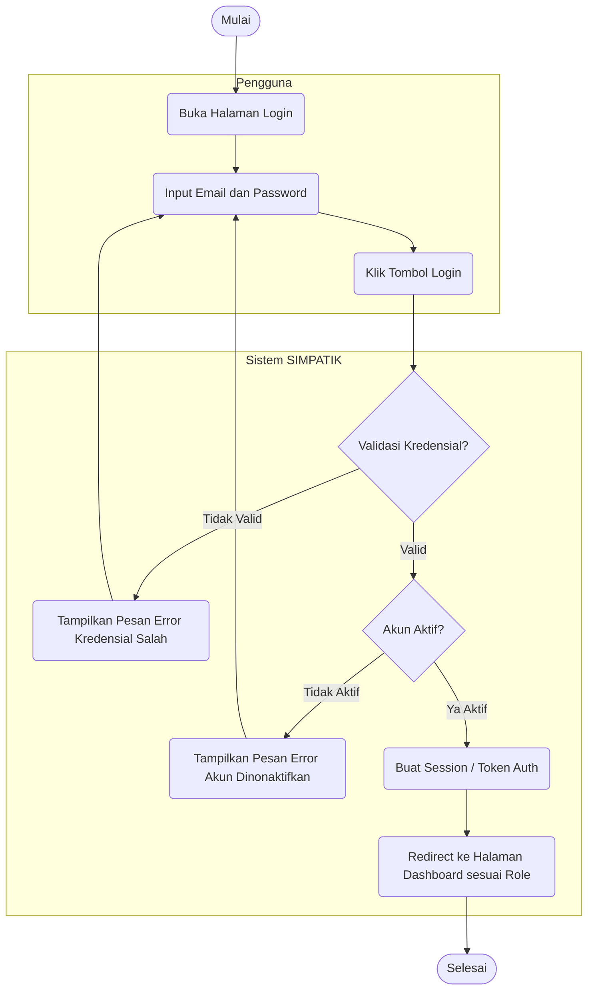
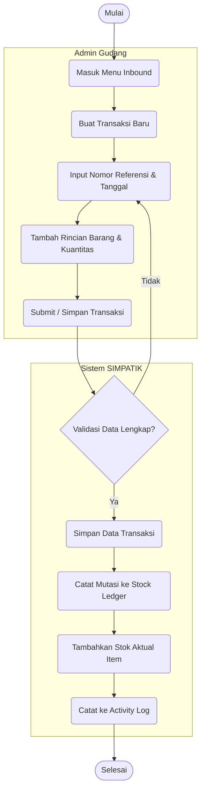
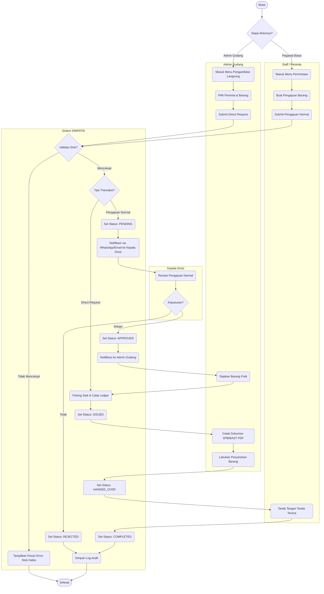
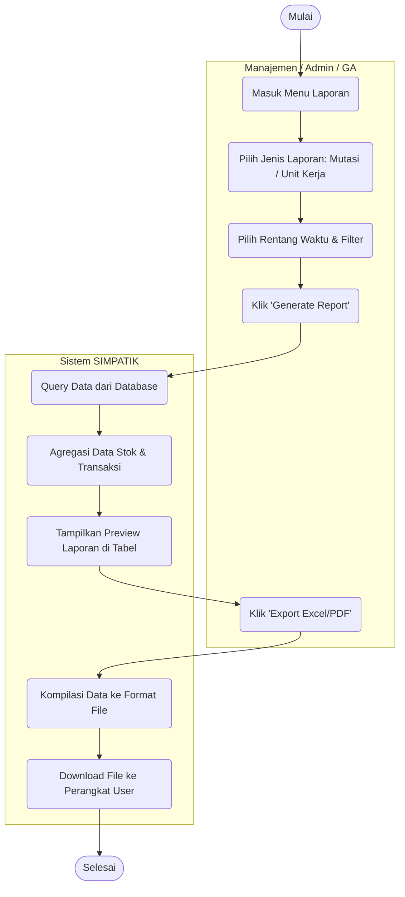
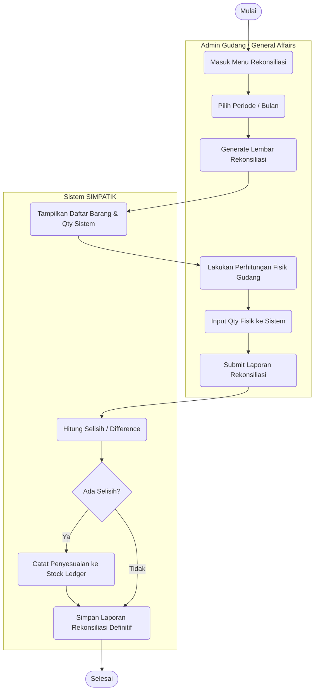
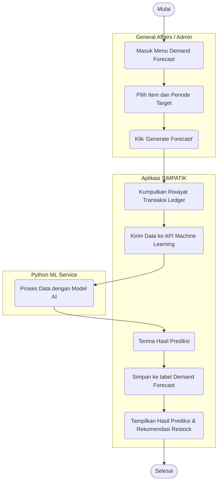

# Laporan Activity Diagram — SIMPATIK

> **Sistem Manajemen Persediaan ATK**
> PT. Bank Pembangunan Daerah Sumatera Selatan dan Bangka Belitung
> Cabang Utama Kapten A. Rivai, Palembang

---

## 1. Pendahuluan

Activity Diagram merupakan diagram perilaku dalam Unified Modeling Language (UML) yang menggambarkan alur kerja (*workflow*) atau aktivitas berurutan dari sebuah sistem. Diagram ini sangat berguna untuk memodelkan logika bisnis dan urutan operasional dari awal hingga akhir, termasuk percabangan logika (keputusan) dan eksekusi paralel.

Pada sistem **SIMPATIK**, Activity Diagram digunakan untuk merinci proses pada fitur-fitur krusial, dengan membagi aktivitas berdasarkan aktor yang terlibat menggunakan *swimlanes* (dipartisi dalam blok/subgraph).

---

## 2. Activity Diagram per Fitur

### 2.1 Proses Autentikasi (*Login*)
Proses dasar yang harus dilalui oleh semua pengguna (Staff, Kepala Divisi, Admin Gudang) sebelum dapat mengakses fitur-fitur di dalam sistem SIMPATIK.

---

### 2.2 Proses Pemasukan Barang (*Inbound Transaction*)
Proses ini dilakukan oleh **Admin Gudang** ketika ada barang ATK baru yang masuk dari vendor (pengadaan).

---

### 2.3 Proses Pengajuan & Pengeluaran Barang (*Outbound Transaction*)
Ini adalah alur operasional utama dan paling kompleks dalam sistem, melibatkan persetujuan berjenjang dari berbagai aktor di departemen berbeda, serta mengakomodasi **Pengajuan Langsung (*Direct Request*)**.

---

### 2.4 Pembuatan Laporan (*Reporting & Export*)
Proses di mana manajemen atau pihak operasional menarik laporan data mutasi dan penggunaan barang per unit kerja, termasuk export ke PDF/Excel.

---

### 2.5 Proses Rekonsiliasi Stok Bulanan (*Stock Reconciliation*)
Dilakukan rutin untuk mencocokkan stok yang ada di dalam *database* sistem dengan stok fisik yang ada di gudang.

---

### 2.6 Proses Prediksi Permintaan (*Demand Forecasting* - ML)
Fitur cerdas yang menggunakan Machine Learning (contoh: XGBoost) untuk memprediksi kebutuhan stok di periode mendatang.

---

## 3. Penjelasan Notasi

*   **Oval Penuh / Garis Tebal Bulat:** Mewakili titik awal (*Start*) dan titik akhir (*End*) dari sebuah alur aktivitas.
*   **Kotak Sudut Melengkung:** Mewakili sebuah aksi atau aktivitas (*Action State*) yang dilakukan oleh manusia maupun sistem.
*   **Belah Ketupat (Diamond):** Mewakili titik keputusan (*Decision Node*) di mana alur akan bercabang berdasarkan kondisi (*Ya/Tidak, Disetujui/Ditolak*).
*   **Garis Panah:** Mewakili arah aliran (*Control Flow*) dari satu aktivitas ke aktivitas berikutnya.
*   **Kotak Putus-Putus (*Subgraph*):** Disebut *Swimlanes*, berfungsi untuk mengelompokkan aktivitas-aktivitas berdasarkan siapa pihak atau entitas (Aktor/Sistem) yang bertanggung jawab mengeksekusinya.
