# Laporan Activity Diagram — SIMPATIK

> **Sistem Manajemen Persediaan ATK**
> PT. Bank Pembangunan Daerah Sumatera Selatan dan Bangka Belitung
> Cabang Utama Kapten A. Rivai, Palembang

---

## 1. Pendahuluan

Activity Diagram merupakan diagram perilaku dalam Unified Modeling Language (UML) yang menggambarkan alur kerja (*workflow*) atau aktivitas berurutan dari sebuah sistem. Diagram ini digunakan untuk memodelkan logika bisnis dan urutan operasional dari awal hingga akhir, termasuk percabangan logika (keputusan) dan pengelompokan tanggung jawab antar aktor menggunakan *swimlanes*.

Pada sistem **SIMPATIK**, setiap *Use Case* yang terdefinisi dalam Diagram Use Case direpresentasikan oleh satu *Activity Diagram* tersendiri (relasi **1 Use Case : 1 Activity Diagram**). Seluruh alur yang digambarkan telah diverifikasi terhadap implementasi nyata pada *source code* sistem, mencakup `OutboundService`, `InboundService`, `UserService`, `ReportService`, semua *Controller*, *Enum* `OutboundStatus`, dan semua kelas *Notification*.

---

## 2. Activity Diagram per Use Case

### AD-01 — Login
Proses autentikasi yang wajib dilalui oleh **seluruh aktor** (Bagian Umum, Admin Gudang, Staff, Penyelia) sebelum dapat mengakses fitur apapun di dalam sistem SIMPATIK. Alur mencakup validasi kredensial via `LoginRequest`, pengecekan status akun aktif, regenerasi sesi (mencegah *session fixation*), lalu langsung *redirect* ke *dashboard* sesuai role.

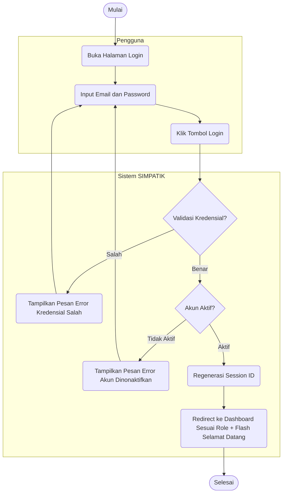

---

### AD-02 — Mengelola Data Master
Proses CRUD (*Create, Read, Update, Delete*) yang dilakukan oleh **Bagian Umum** untuk menjaga akurasi data referensi sistem. Mencakup tiga sub-modul: **Barang** (`ItemController`), **Kategori** (`CategoryController`), dan **Unit Kerja** (`DepartmentController`). Semua operasi hapus menggunakan *soft delete* — data tidak benar-benar dihapus dari *database*.

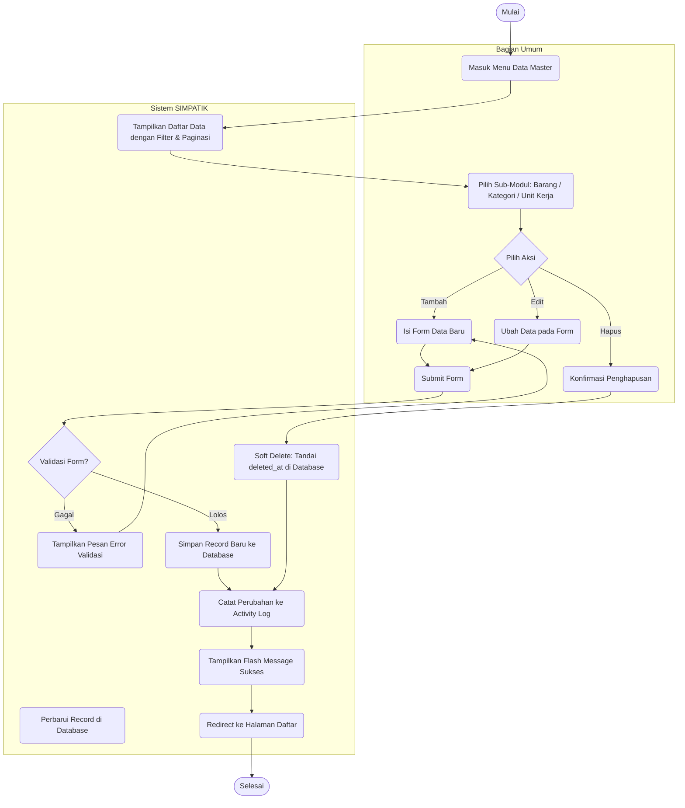

---

### AD-03 — Menginput Barang Masuk
Proses pencatatan penerimaan stok ATK dari vendor yang dilakukan oleh **Bagian Umum**. Upload bukti transaksi (nota/faktur/surat jalan) bersifat **wajib** — transaksi tidak dapat disimpan tanpa lampiran dokumen fisik (format: JPG/PNG/PDF, maks 2MB). Saat transaksi berhasil disimpan, sistem menambah stok aktual dan mencatat mutasi ke *Stock Ledger* dalam satu *database transaction* dengan *pessimistic locking*.

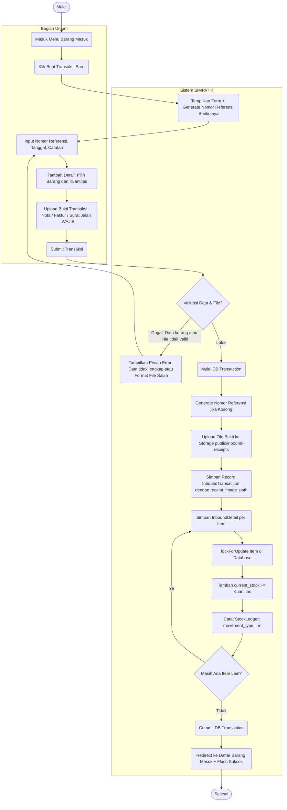

---

### AD-04 — Mengelola Pengguna
Proses manajemen akun pengguna sistem yang dilakukan oleh **Bagian Umum**. Mencakup operasi CRUD, toggle status aktif/nonaktif, dan impor massal dari file Excel/CSV. Setiap perubahan role akan otomatis menyinkronkan permission via Spatie Permission sesuai definisi di `UserRole` enum.

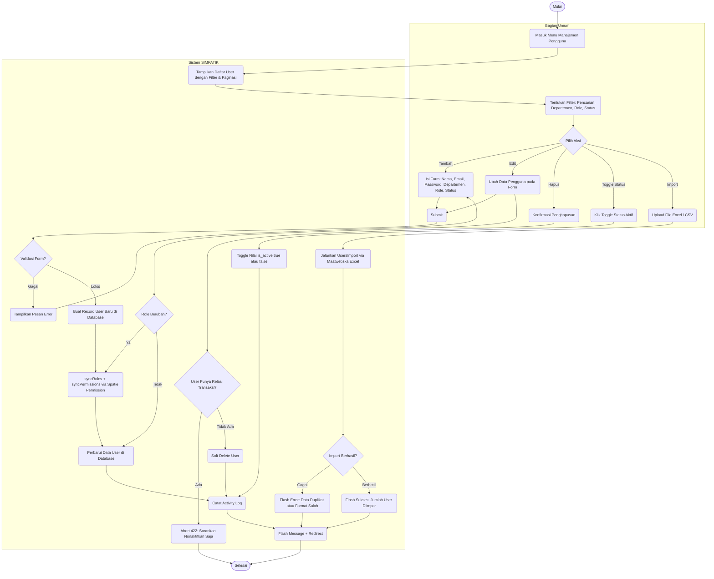

---

### AD-05 — Melihat Audit Trail Digital
Proses membaca log aktivitas seluruh pengguna di dalam sistem yang hanya dapat diakses oleh **Bagian Umum**. Setiap aksi yang tercatat mencakup informasi: siapa yang melakukan, aksi apa, kapan, di modul mana, serta data `properties` yang berisi *diff* data sebelum dan sesudah perubahan.

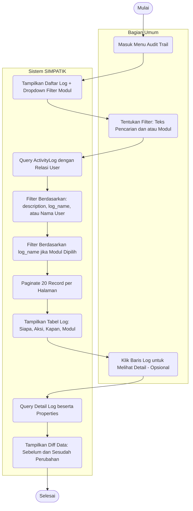

---

### AD-06 — Mengelola Pengaturan Sistem
Proses konfigurasi parameter aplikasi yang dilakukan oleh **Bagian Umum**. Data disimpan sebagai pasangan *key-value* di tabel `settings` menggunakan mekanisme `updateOrCreate` (*upsert*), sehingga tidak perlu membedakan antara tambah atau ubah — cukup satu operasi *submit*.

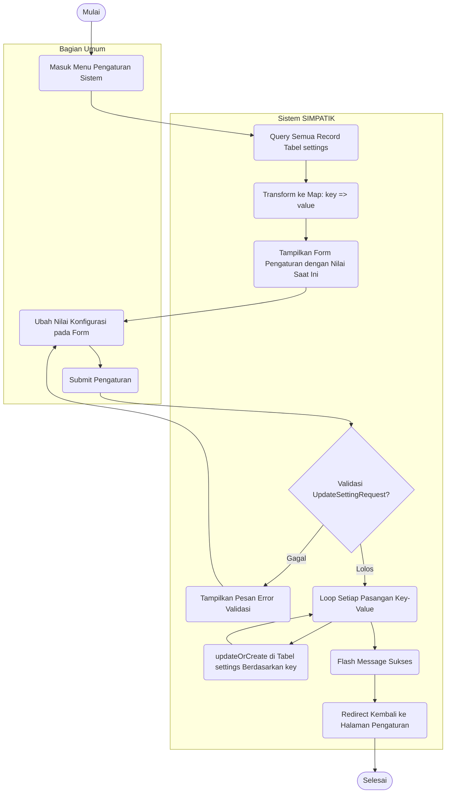

---

### AD-07 — Melihat Laporan & Rekonsiliasi
Proses pelaporan dan rekonsiliasi stok. **Bagian Umum** memiliki akses penuh termasuk ekspor (permission `export-reports`). **Admin Gudang** hanya dapat melihat laporan (permission `view-reports`) tanpa bisa mengekspor. Sub-alur rekonsiliasi mencakup: unduh *worksheet* Excel untuk penghitungan fisik di lapangan → input hasil ke sistem → *submit* → unduh Berita Acara PDF sebagai dokumen resmi.

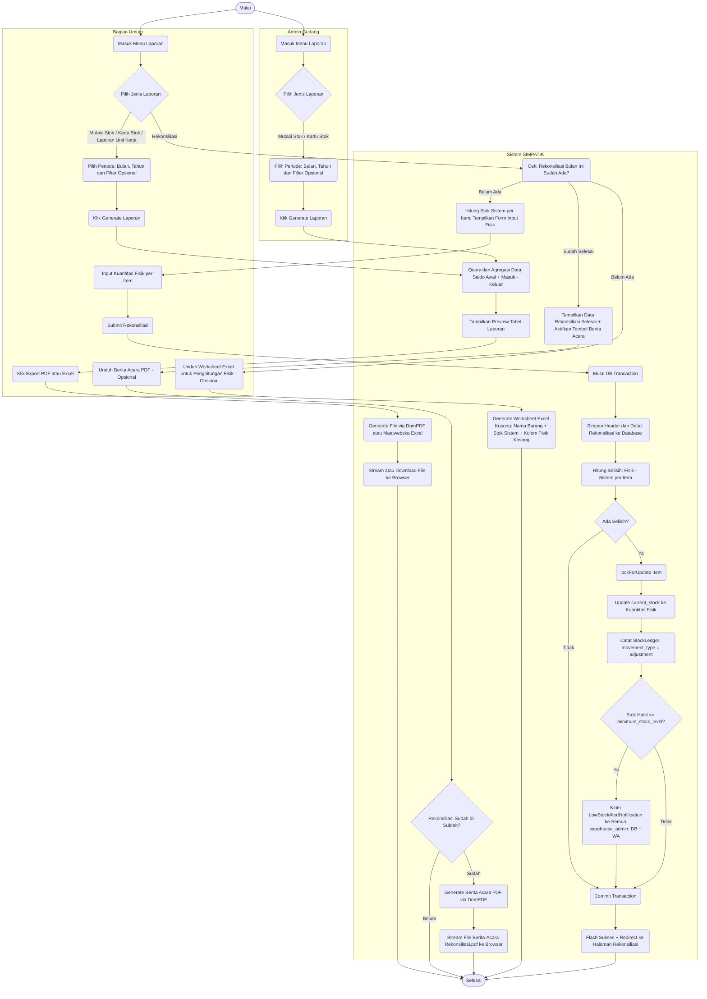

---

### AD-08 — Mengajukan Permintaan Barang
Proses pembuatan pengajuan permintaan barang oleh **Staff** atau **Penyelia**. Terdapat logika khusus: jika pemohon adalah Penyelia, sistem secara otomatis menetapkan status `Approved` (*auto-approve*) dan langsung mengirim notifikasi ke Admin Gudang tanpa melewati tahap verifikasi. Jika pemohon adalah Staff biasa, status menjadi `Pending` dan notifikasi dikirim ke Penyelia di departemen yang sama.

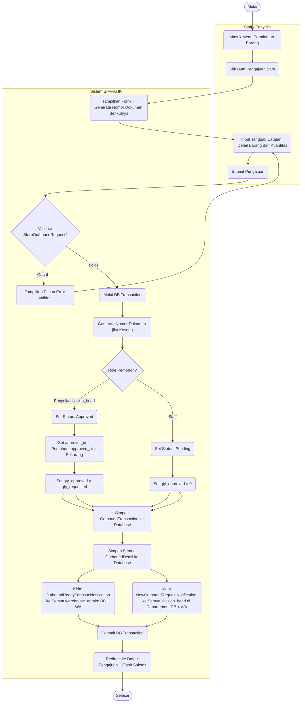

---

### AD-09 — Mengonfirmasi Serah Terima Barang
Proses penutupan siklus transaksi fisik yang melibatkan **Admin Gudang** (menyerahkan barang) dan **Staff/Penyelia** (mengkonfirmasi penerimaan). Dua langkah ini dilakukan secara berurutan: transaksi berstatus `HandedOver` setelah Admin Gudang menyerahkan, lalu berstatus `Completed` setelah pemohon mengkonfirmasi penerimaan. Pada setiap langkah, notifikasi dikirim via *database* dan WhatsApp.

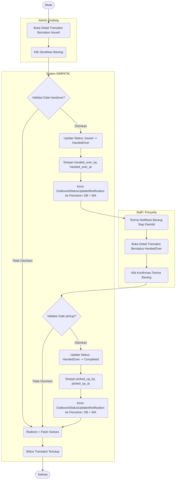

---

### AD-10 — Cetak Dokumen Transaksi
Proses generasi dan pengunduhan dokumen resmi berbasis PDF oleh **Staff** atau **Admin Gudang**. Terdapat dua jenis dokumen: **SPB** (Surat Permintaan Barang) yang bisa dicetak oleh keduanya kapan saja, dan **BAST** (Berita Acara Serah Terima) yang hanya bisa dicetak setelah barang benar-benar diserahkan (status `HandedOver` atau `Completed`). Setiap dokumen PDF dilengkapi dengan *QR Code* untuk validasi keaslian.

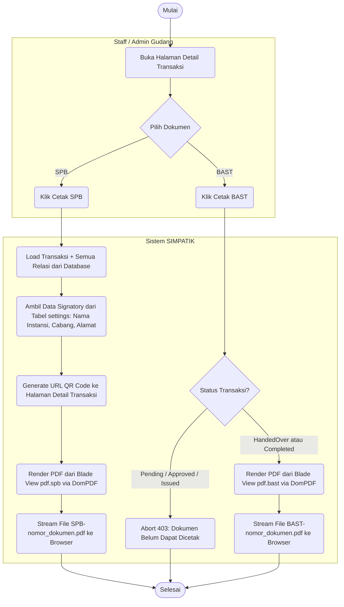

---

### AD-11 — Verifikasi Permintaan Barang
Proses persetujuan atau penolakan pengajuan barang yang dilakukan oleh **Penyelia**. Penyelia hanya dapat melihat pengajuan dari unit kerjanya sendiri (*view-own-unit-requests*). Saat menyetujui, Penyelia dapat menyesuaikan kuantitas yang disetujui (tidak boleh melebihi yang diminta). Setelah disetujui, notifikasi dikirim ke pemohon sekaligus ke Admin Gudang untuk ditindaklanjuti.

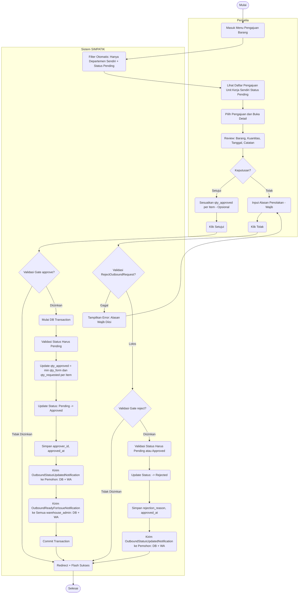

---

### AD-12 — Membuat Permintaan Langsung
Proses pengeluaran barang instan oleh **Admin Gudang** yang melewati (*bypass*) seluruh tahap verifikasi Penyelia. Begitu transaksi disimpan, status langsung menjadi `Issued` dan stok barang otomatis terpotong dalam satu *database transaction* dengan *pessimistic locking*. Tidak ada notifikasi yang dikirim pada alur ini.

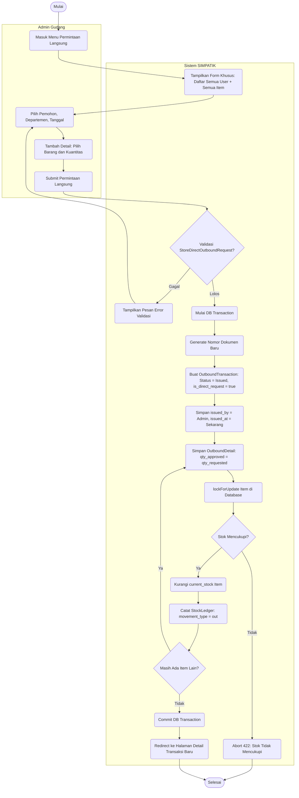

---

### AD-13 — Menyetujui Permintaan Barang
Proses persetujuan akhir dan pengeluaran barang secara sistem oleh **Admin Gudang**. Ini adalah tahap di mana stok barang benar-benar dipotong dari *database*. Admin Gudang dapat menyesuaikan kuantitas yang dikeluarkan, namun tidak boleh melebihi kuantitas yang sudah disetujui Penyelia. Jika stok barang menyentuh batas minimum setelah pemotongan, sistem otomatis mengirim peringatan *Low Stock Alert*.

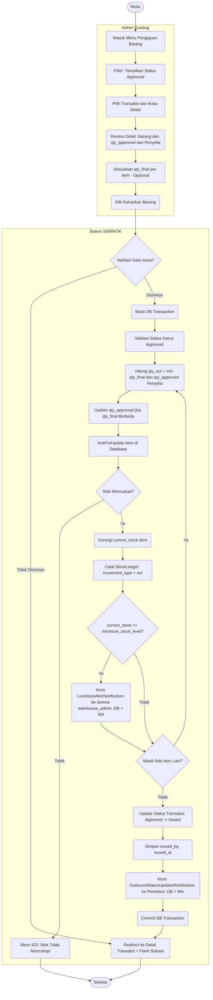

---

### AD-14 — Melihat Data Barang
Proses pemantauan data dan stok barang yang dilakukan oleh **Admin Gudang**. Admin Gudang memiliki permission `view-items` (bukan `manage-items`), sehingga hanya dapat membaca data barang tanpa bisa mengubah atau menambah. Terdapat filter khusus `low_stock` untuk langsung menyaring barang-barang yang stoknya sudah menyentuh atau di bawah batas minimum.

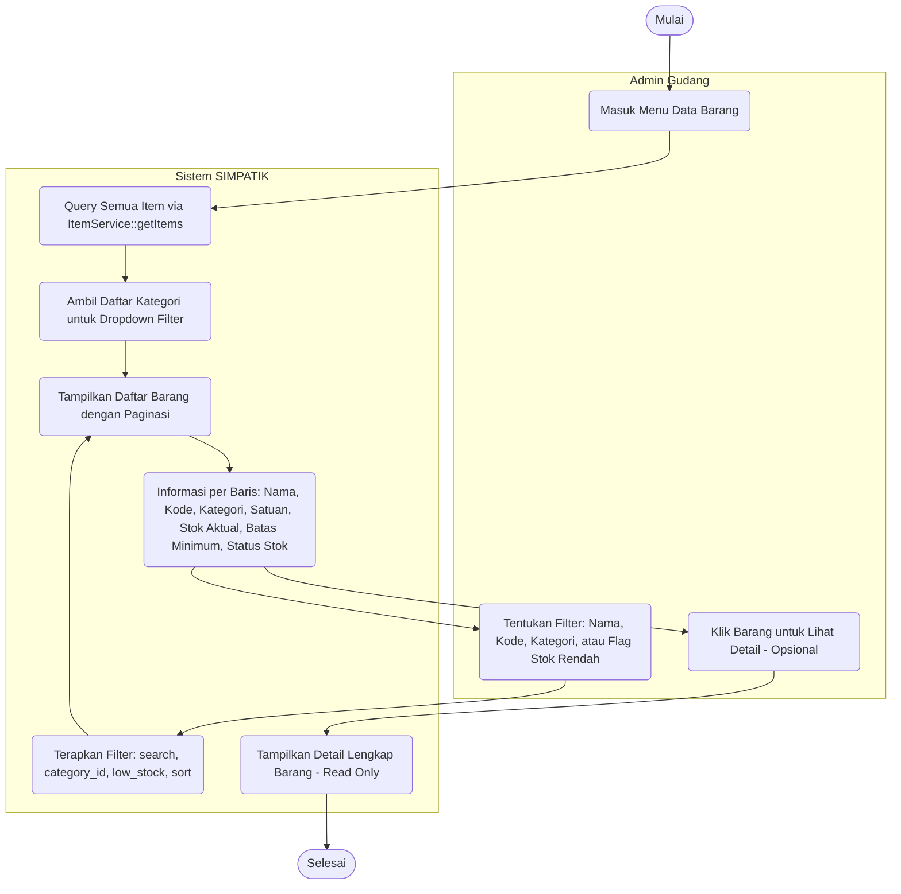

---

## 3. Penjelasan Notasi

| Notasi | Representasi |
|--------|-------------|
| **Oval `([...])` di luar swimlane** | Titik awal (*Start*) dan titik akhir (*End*) dari sebuah alur aktivitas |
| **Kotak sudut melengkung `(...)` di dalam swimlane** | Aksi atau aktivitas (*Action State*) yang dilakukan oleh manusia maupun sistem |
| **Belah ketupat `{...}`** | Titik keputusan (*Decision Node*) — alur bercabang berdasarkan kondisi |
| **Garis panah `-->`** | Arah aliran kontrol (*Control Flow*) dari satu aktivitas ke aktivitas berikutnya |
| **Label pada garis panah `-- teks -->`** | Kondisi atau hasil keputusan yang menentukan cabang alur yang diambil |
| **Kotak `subgraph [Nama]`** | *Swimlane* — mengelompokkan aktivitas berdasarkan aktor/entitas yang bertanggung jawab |
| **Notasi `DB + WA` pada notifikasi** | Notifikasi dikirim melalui dua kanal sekaligus: *in-app* (database) dan WhatsApp API |
| **Notasi `lockForUpdate`** | *Pessimistic lock* pada baris database — mencegah *race condition* saat memotong stok |
| **Notasi `soft delete`** | Data tidak benar-benar dihapus; hanya ditandai dengan nilai `deleted_at` di database |
