# Laporan Activity Diagram — SIMPATIK

> **Sistem Manajemen Persediaan ATK**
> PT. Bank Pembangunan Daerah Sumatera Selatan dan Bangka Belitung
> Cabang Utama Kapten A. Rivai, Palembang

---

## 1. Pendahuluan

Activity Diagram merupakan diagram perilaku dalam Unified Modeling Language (UML) yang menggambarkan alur kerja (*workflow*) atau aktivitas berurutan dari sebuah sistem. Diagram ini digunakan untuk memodelkan logika bisnis dan urutan operasional dari awal hingga akhir.

Pada sistem **SIMPATIK**, setiap *Use Case* utama direpresentasikan oleh satu *Activity Diagram*. Diagram ini menggambarkan interaksi antara aktor (Pengguna, Bagian Umum, Admin Gudang, Staff, Penyelia) dengan Sistem secara akurat sesuai dengan kondisi nyata sistem saat ini.

---

## 2. Activity Diagram per Use Case

### AD-01 — Login [X]
Proses autentikasi yang membedakan hak akses (*role*) setiap aktor setelah berhasil login.

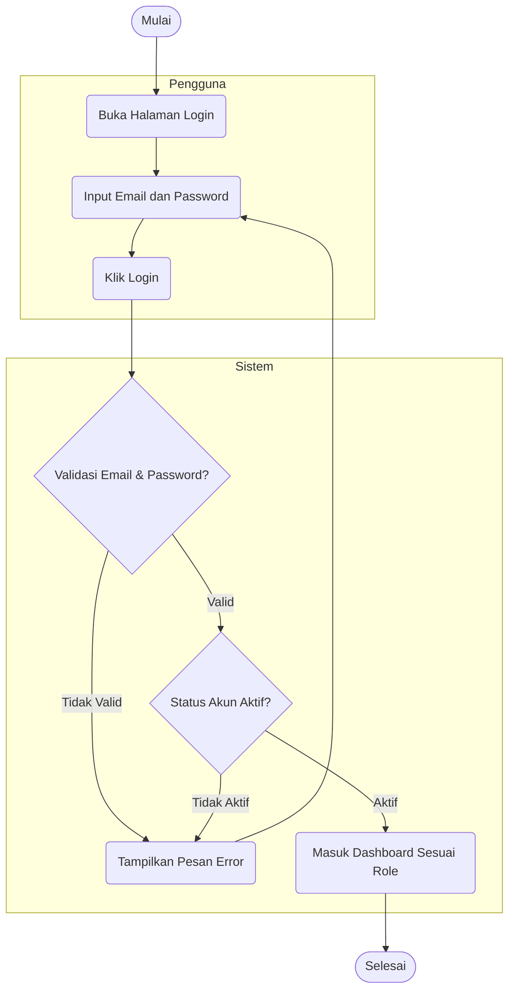

---

### AD-02 — Mengelola Data Master [X]
Proses pengelolaan data master oleh Bagian Umum, termasuk penandaan penghapusan sementara (*soft delete*).

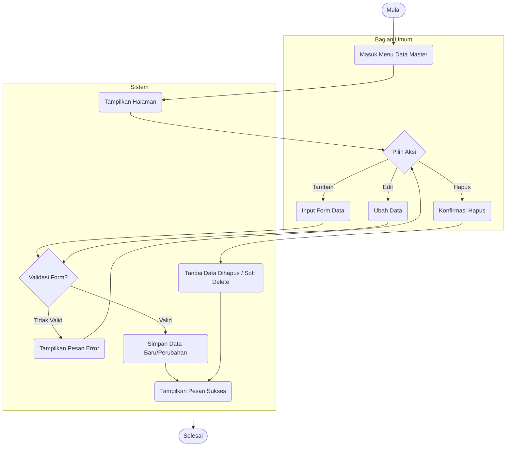

---

### AD-03 — Menginput Barang Masuk [X]
Proses pencatatan barang dari vendor, dengan kewajiban melampirkan bukti transaksi.

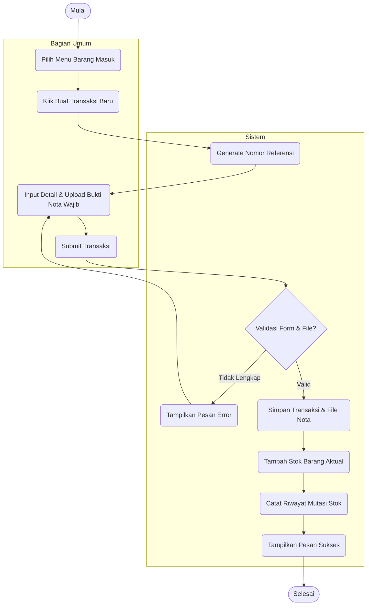

---

### AD-04 — Mengelola Pengguna [X]
Proses pengelolaan akun pengguna. Penghapusan akan dicegah jika pengguna sudah memiliki riwayat transaksi.

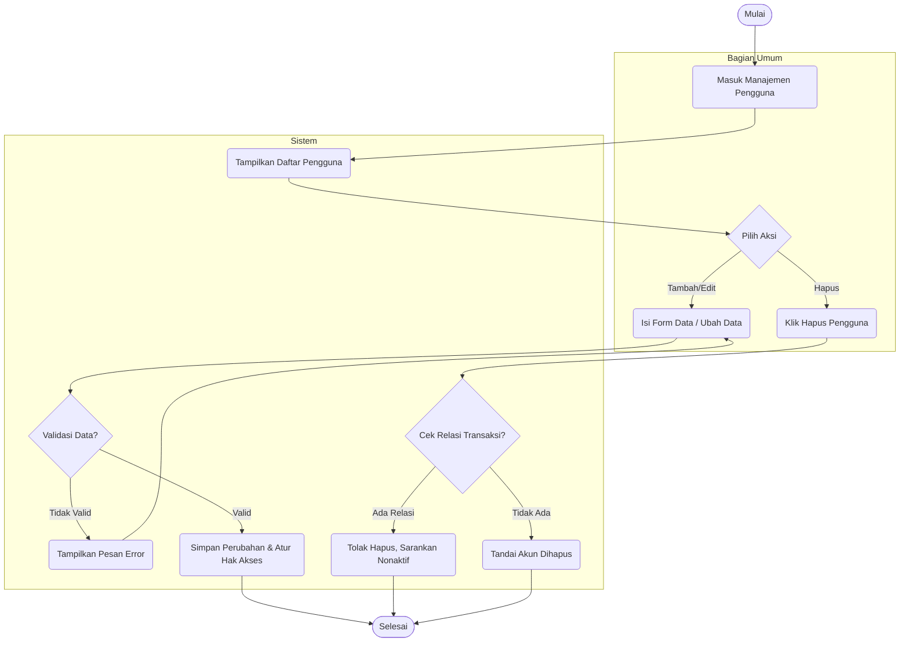

---

### AD-05 — Melihat Audit Trail Digital [X]
Proses melihat log aktivitas beserta detail perubahan data sebelum dan sesudahnya.

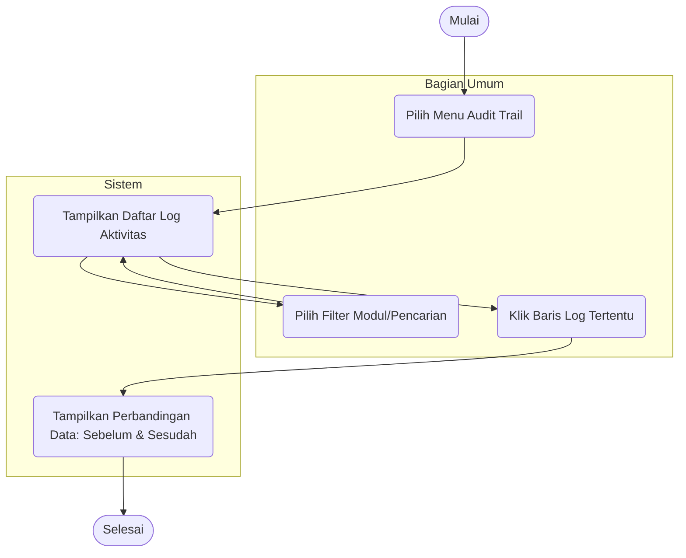

---

### AD-06 — Mengelola Pengaturan Sistem [X]
Proses menyimpan konfigurasi dasar yang menampilkan nilai (*value*) pengaturan saat ini.

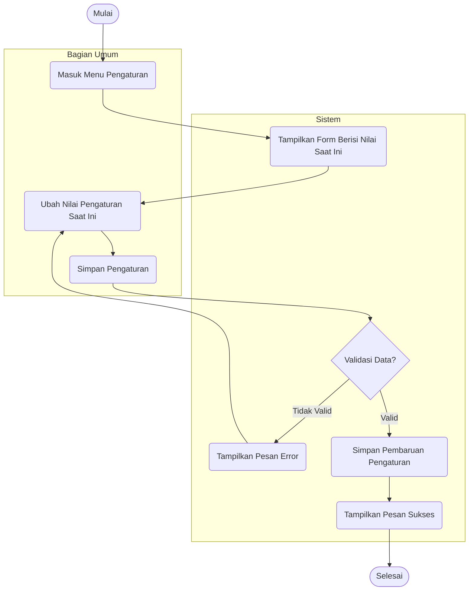

---

### AD-07 — Melihat Laporan & Rekonsiliasi [X]
Proses membuat laporan umum dan melakukan input rekonsiliasi stok fisik versus sistem.

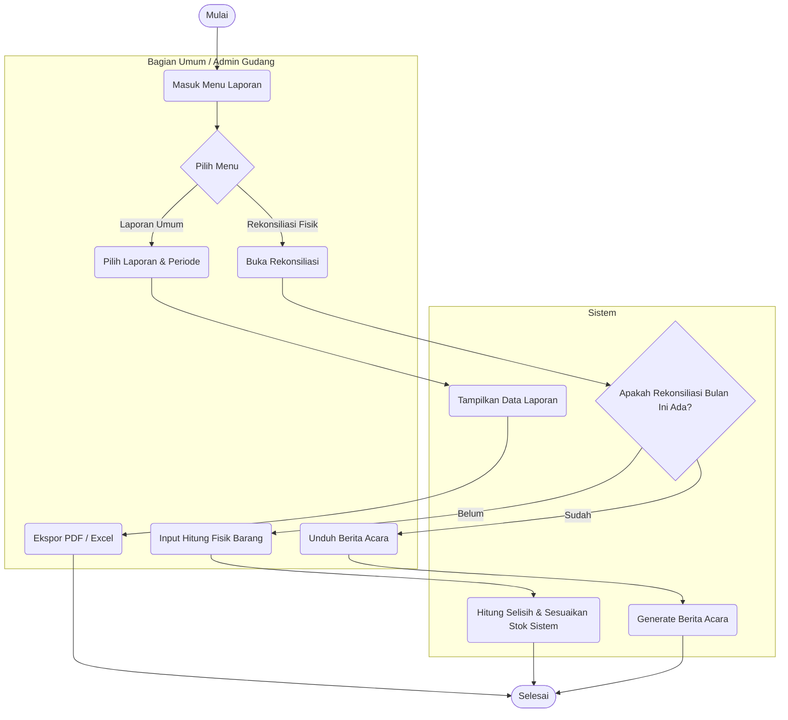

---

### AD-08 — Mengajukan Permintaan Barang [X]
Permintaan barang dari Staff (butuh persetujuan) berbeda dengan Penyelia (otomatis disetujui).

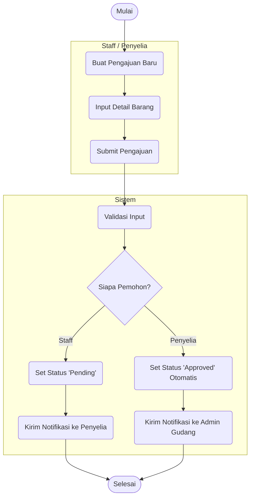

---

### AD-09 — Mengonfirmasi Serah Terima Barang [X]
Proses dua arah: Admin Gudang menyerahkan, kemudian Pemohon mengonfirmasi penerimaan secara fisik.

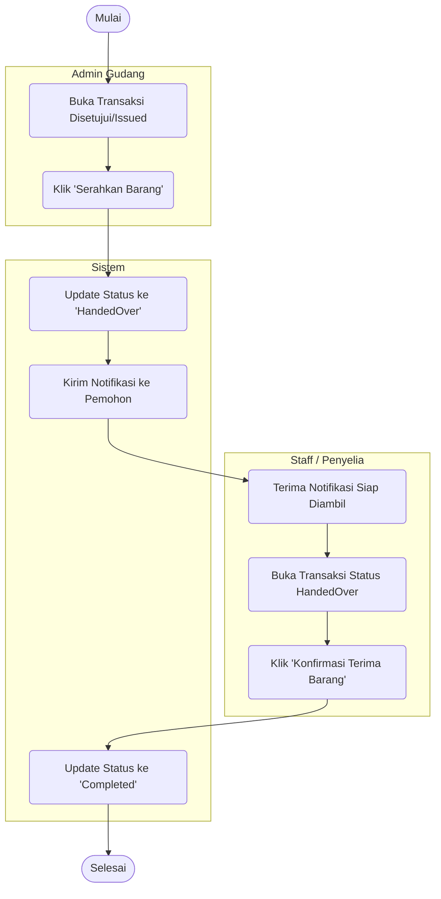

---

### AD-10 — Cetak Dokumen Transaksi [X]
SPB dapat dicetak di awal, tetapi BAST baru bisa dicetak setelah serah terima selesai.

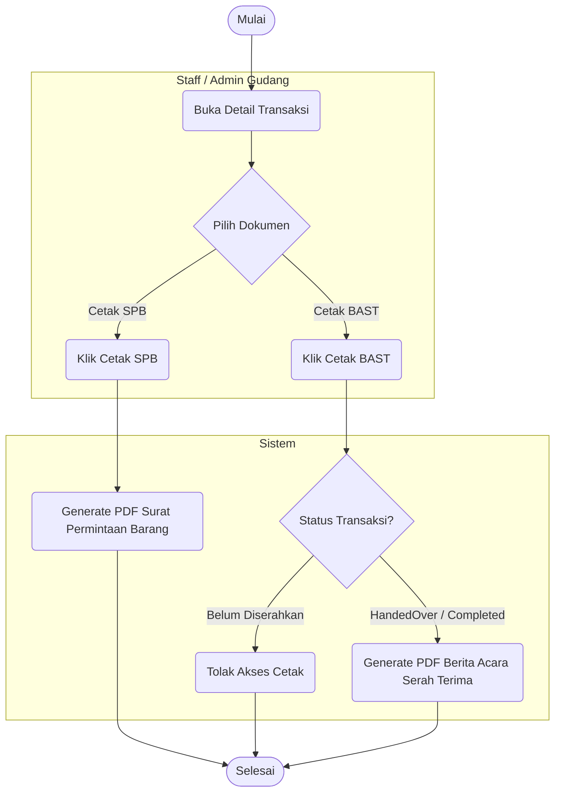

---

### AD-11 — Verifikasi Permintaan Barang
Penyelia melakukan peninjauan terhadap pengajuan dari Staff. Bisa sesuaikan jumlah atau menolak dengan alasan.

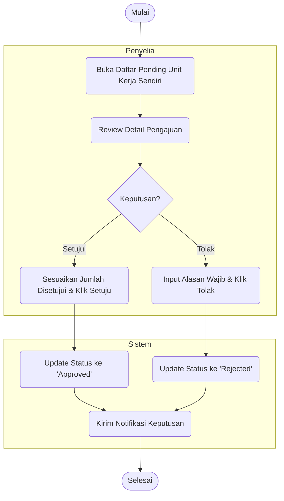

---

### AD-12 — Membuat Permintaan Langsung [X]
Admin gudang mengeluarkan barang tanpa melalui alur verifikasi penyelia (potong stok langsung).

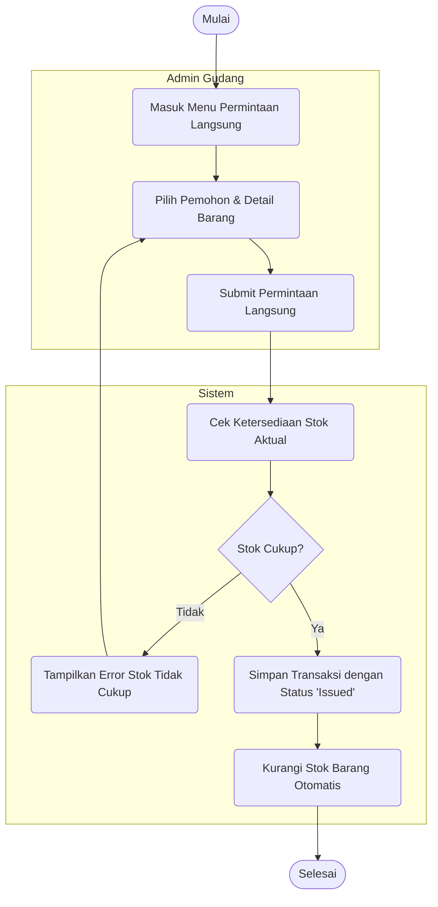

---

### AD-13 — Menyetujui Permintaan Barang [X]
Tindakan Admin Gudang untuk benar-benar mengeluarkan stok dari pengajuan yang sudah disetujui (Approved).

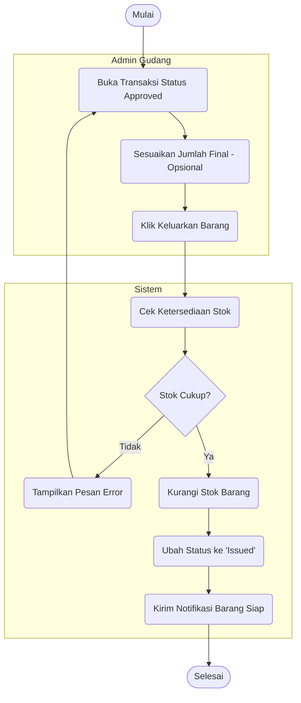

---

### AD-14 — Melihat Data Barang [X]
Pemantauan data stok oleh Admin Gudang dengan ketersediaan fitur filter khusus peringatan stok minim.

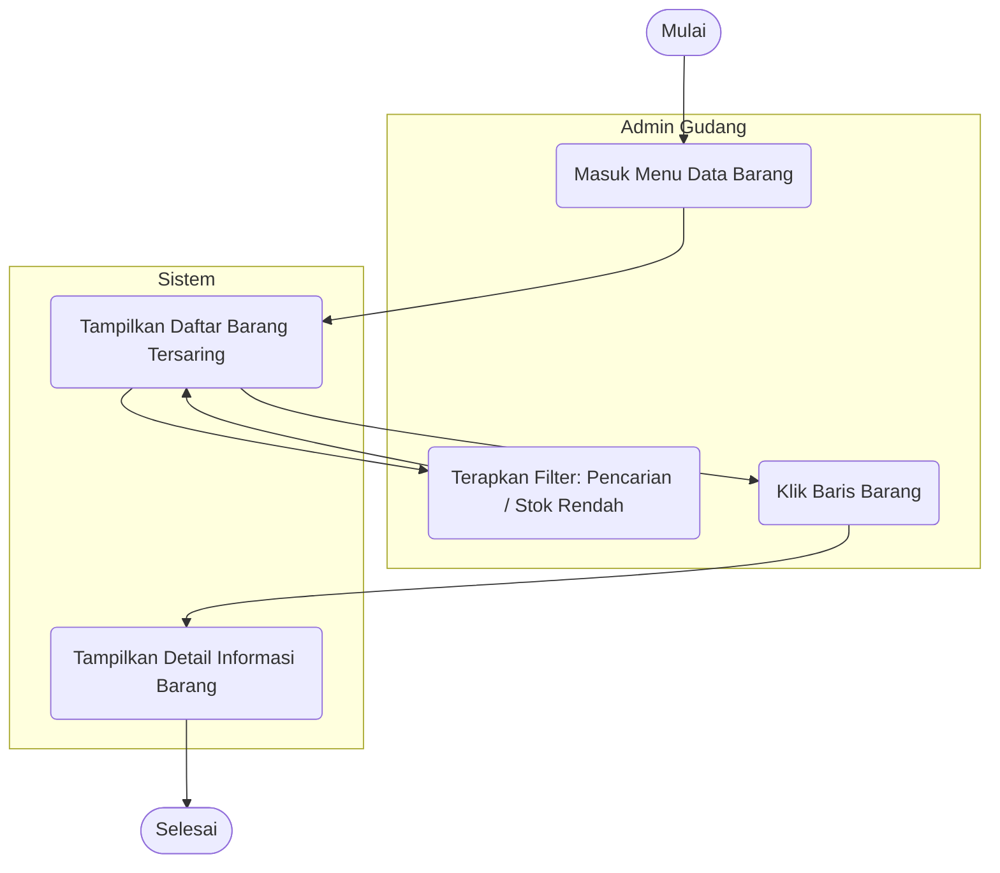

---

## 3. Penjelasan Notasi

| Notasi | Representasi |
|--------|-------------|
| **Oval `([...])`** | Titik awal (*Start*) dan titik akhir (*End*) dari sebuah alur aktivitas |
| **Kotak sudut melengkung `(...)`** | Aksi atau aktivitas (*Action State*) yang dilakukan aktor / sistem |
| **Belah ketupat `{...}`** | Titik keputusan (*Decision Node*) — alur bercabang berdasarkan kondisi |
| **Garis panah `-->`** | Arah aliran kontrol (*Control Flow*) dari satu aktivitas ke aktivitas berikutnya |
| **Label pada garis panah `-- teks -->`** | Kondisi atau hasil keputusan yang menentukan cabang alur yang diambil |
| **Kotak `subgraph [Nama]`** | *Swimlane* — mengelompokkan aktivitas berdasarkan entitas yang bertanggung jawab |
