# Laporan Class Diagram — SIMPATIK

> **Sistem Manajemen Persediaan ATK**
> PT. Bank Pembangunan Daerah Sumatera Selatan dan Bangka Belitung
> Cabang Utama Kapten A. Rivai, Palembang

---

## 1. Pendahuluan

Class diagram ini dirancang untuk merepresentasikan seluruh entitas (Model) yang terlibat dalam proses pengelolaan persediaan ATK pada sistem **SIMPATIK**. Sesuai standar pemodelan UML, diagram ini memuat nama kelas, atribut (properti/kolom), beserta method (fungsi operasional maupun relasi Eloquent). 

Untuk mempermudah pemetaan ke dalam bentuk fisik basis data (layaknya *Entity Relationship Diagram*), atribut yang berfungsi sebagai kunci tamu (*Foreign Key*) telah diberikan penanda khusus **FK**. 

---

## 2. Class Diagram

```mermaid
classDiagram
    direction TB

    class User {
        -id : BigInt
        -name : String
        -email : String
        -phone_number : String
        -password : String
        -signature_path : String
        -is_active : Boolean
        -department_id : BigInt FK
        -email_verified_at : DateTime
        -remember_token : String
        -created_at : Timestamp
        -updated_at : Timestamp
        -deleted_at : Timestamp
        +getSignatureUrlAttribute() String
        +isActive() bool
        +needsSignatureOnboarding() bool
        +getRoleName() String
        +department() BelongsTo~Department~
        +inboundTransactions() HasMany~InboundTransaction~
        +outboundRequestsAsRequester() HasMany~OutboundTransaction~
        +outboundRequestsAsApprover() HasMany~OutboundTransaction~
        +outboundRequestsAsIssuer() HasMany~OutboundTransaction~
    }

    class Role {
        -id : BigInt
        -name : String
        -guard_name : String
        -created_at : Timestamp
        -updated_at : Timestamp
    }

    class Permission {
        -id : BigInt
        -name : String
        -guard_name : String
        -created_at : Timestamp
        -updated_at : Timestamp
    }

    class ModelHasRole {
        <<Pivot Table>>
        -role_id : BigInt FK
        -model_type : String
        -model_id : BigInt FK
    }

    class RoleHasPermission {
        <<Pivot Table>>
        -permission_id : BigInt FK
        -role_id : BigInt FK
    }

    class ActivityLog {
        -id : BigInt
        -user_id : BigInt FK
        -log_name : String
        -description : String
        -subject_type : String
        -subject_id : BigInt
        -properties : JSON
        -ip_address : String
        -user_agent : String
        -created_at : Timestamp
        -updated_at : Timestamp
        +user() BelongsTo~User~
        +subject() MorphTo
    }

    class Category {
        -id : BigInt
        -name : String
        -created_at : Timestamp
        -updated_at : Timestamp
        -deleted_at : Timestamp
        +items() HasMany~Item~
    }

    class Item {
        -id : BigInt
        -category_id : BigInt FK
        -item_code : String
        -name : String
        -unit_of_measure : String
        -unit_price : Decimal
        -current_stock : Integer
        -minimum_stock_level : Integer
        -created_at : Timestamp
        -updated_at : Timestamp
        -deleted_at : Timestamp
        +category() BelongsTo~Category~
        +inboundTransactionDetails() HasMany~InboundTransactionDetail~
        +outboundTransactionDetails() HasMany~OutboundTransactionDetail~
        +stockLedgers() HasMany~StockLedger~
        +demandForecasts() HasMany~DemandForecast~
        +isLowStock() bool
    }

    class Department {
        -id : BigInt
        -name : String
        -created_at : Timestamp
        -updated_at : Timestamp
        -deleted_at : Timestamp
        +users() HasMany~User~
        +outboundTransactions() HasMany~OutboundTransaction~
    }

    class InboundTransaction {
        -id : BigInt
        -user_id : BigInt FK
        -reference_number : String
        -transaction_date : Date
        -notes : String
        -created_at : Timestamp
        -updated_at : Timestamp
        +user() BelongsTo~User~
        +details() HasMany~InboundTransactionDetail~
    }

    class InboundTransactionDetail {
        -id : BigInt
        -inbound_transaction_id : BigInt FK
        -item_id : BigInt FK
        -quantity : Integer
        -unit_price : Decimal
        +inboundTransaction() BelongsTo~InboundTransaction~
        +item() BelongsTo~Item~
    }

    class OutboundTransaction {
        -id : BigInt
        -requester_id : BigInt FK
        -approver_id : BigInt FK
        -issued_by : BigInt FK
        -handed_over_by : BigInt FK
        -picked_up_by : BigInt FK
        -department_id : BigInt FK
        -document_number : String
        -transaction_date : Date
        -status : String
        -approved_at : DateTime
        -issued_at : DateTime
        -handed_over_at : DateTime
        -picked_up_at : DateTime
        -is_special_request : Boolean
        -is_direct_request : Boolean
        -rejection_reason : String
        -notes : String
        -created_at : Timestamp
        -updated_at : Timestamp
        -deleted_at : Timestamp
        +requester() BelongsTo~User~
        +approver() BelongsTo~User~
        +issuedByUser() BelongsTo~User~
        +handedOverByUser() BelongsTo~User~
        +pickedUpByUser() BelongsTo~User~
        +department() BelongsTo~Department~
        +details() HasMany~OutboundTransactionDetail~
        +isPending() bool
        +isApproved() bool
        +isIssued() bool
        +isHandedOver() bool
        +isCompleted() bool
        +isRejected() bool
    }

    class OutboundTransactionDetail {
        -id : BigInt
        -outbound_transaction_id : BigInt FK
        -item_id : BigInt FK
        -quantity_requested : Integer
        -quantity_approved : Integer
        -notes : String
        +outboundTransaction() BelongsTo~OutboundTransaction~
        +item() BelongsTo~Item~
    }

    class StockLedger {
        -id : BigInt
        -item_id : BigInt FK
        -transaction_date : Date
        -movement_type : String
        -document_reference : String
        -qty_in : Integer
        -qty_out : Integer
        -ending_balance : Integer
        -created_at : Timestamp
        -updated_at : Timestamp
        +item() BelongsTo~Item~
    }

    class DemandForecast {
        -id : BigInt
        -item_id : BigInt FK
        -target_period : String
        -forecasted_demand : Integer
        -suggested_order_qty : Integer
        -model_version : String
        -mae_score : Decimal
        -created_at : Timestamp
        -updated_at : Timestamp
        +item() BelongsTo~Item~
    }

    class StockReconciliation {
        -id : BigInt
        -month : Integer
        -year : Integer
        -reconciliation_date : Date
        -created_by : BigInt FK
        -notes : String
        -created_at : Timestamp
        -updated_at : Timestamp
        +details() HasMany~StockReconciliationDetail~
        +creator() BelongsTo~User~
    }

    class StockReconciliationDetail {
        -id : BigInt
        -reconciliation_id : BigInt FK
        -item_id : BigInt FK
        -system_qty : Integer
        -physical_qty : Integer
        -difference : Integer
        -notes : String
        +reconciliation() BelongsTo~StockReconciliation~
        +item() BelongsTo~Item~
    }

    class Setting {
        -id : BigInt
        -key : String
        -value : Text
        -created_at : Timestamp
        -updated_at : Timestamp
        +getValue(key, default)$ String
    }

    %% Relasi Antar Entitas (Sesuai Standar UML dengan Multiplicity)
    User "1" --> "0..*" ModelHasRole : Directed Association (memiliki pivot)
    Role "1" --> "0..*" ModelHasRole : Directed Association (terhubung pivot)
    
    Role "1" --> "0..*" RoleHasPermission : Directed Association (memiliki pivot)
    Permission "1" --> "0..*" RoleHasPermission : Directed Association (terhubung pivot)

    Department "1" o-- "0..*" User : menaungi
    Category "1" o-- "0..*" Item : mengklasifikasi
    
    User "1" --> "0..*" InboundTransaction : mencatat
    InboundTransaction "1" *-- "1..*" InboundTransactionDetail : berisi
    Item "1" --> "0..*" InboundTransactionDetail : terdata pada
    
    User "1" --> "0..*" OutboundTransaction : mengajukan / memproses
    Department "1" --> "0..*" OutboundTransaction : meminta
    OutboundTransaction "1" *-- "1..*" OutboundTransactionDetail : berisi
    Item "1" --> "0..*" OutboundTransactionDetail : terdata pada
    
    Item "1" *-- "0..*" StockLedger : mempunyai riwayat
    Item "1" *-- "0..*" DemandForecast : mempunyai prediksi
    
    User "1" --> "0..*" StockReconciliation : membuat
    StockReconciliation "1" *-- "1..*" StockReconciliationDetail : berisi
    Item "1" --> "0..*" StockReconciliationDetail : direkonsiliasi pada
    
    User "0..1" --> "0..*" ActivityLog : melakukan
```

---

## 3. Rangkuman Relasi Entitas

| Dari | Ke | Kata Kerja Relasi | Multiplicity | Keterangan |
|------|-----|-------------------|--------------|------------|
| `Department` | `User` | menaungi | `1` to `0..*` | 1 Departemen menaungi 0 atau banyak pengguna. |
| `Department` | `OutboundTransaction` | meminta | `1` to `0..*` | 1 Departemen meminta 0 atau banyak transaksi keluar. |
| `Category` | `Item` | mengklasifikasi | `1` to `0..*` | 1 Kategori mengklasifikasi 0 atau banyak barang. |
| `User` | `InboundTransaction` | mencatat | `1` to `0..*` | 1 Admin gudang mencatat 0 atau banyak pemasukan barang. |
| `User` | `OutboundTransaction` | mengajukan / memproses | `1` to `0..*` | 1 Pengguna mengajukan/memproses 0 atau banyak transaksi. |
| `User` | `StockReconciliation` | membuat | `1` to `0..*` | 1 Pengguna membuat 0 atau banyak rekonsiliasi stok. |
| `User` | `ActivityLog` | melakukan | `0..1` to `0..*` | 1 Pengguna (atau 0 jika *system log*) melakukan 0 atau banyak aktivitas. |
| `User` | `ModelHasRole` | terdata pada | `1` to `0..*` | 1 Pengguna (sebagai model) terdata pada 0 atau banyak pivot peran. |
| `Role` | `ModelHasRole` | dimiliki oleh | `1` to `0..*` | 1 Peran dapat dimiliki oleh 0 atau banyak pengguna melalui pivot. |
| `Role` | `RoleHasPermission` | terhubung ke | `1` to `0..*` | 1 Peran terhubung ke 0 atau banyak pivot hak akses. |
| `Permission` | `RoleHasPermission` | dimiliki oleh | `1` to `0..*` | 1 Hak Akses dapat dimiliki oleh 0 atau banyak peran melalui pivot. |
| `InboundTransaction` | `InboundTransactionDetail` | berisi | `1` to `1..*` | 1 Transaksi mutlak berisi minimal 1 atau banyak rincian barang. |
| `OutboundTransaction` | `OutboundTransactionDetail` | berisi | `1` to `1..*` | 1 Pengajuan mutlak berisi minimal 1 atau banyak rincian barang. |
| `Item` | `InboundTransactionDetail` | terdata pada | `1` to `0..*` | 1 Barang terdata pada 0 atau banyak rincian barang masuk. |
| `Item` | `OutboundTransactionDetail` | terdata pada | `1` to `0..*` | 1 Barang terdata pada 0 atau banyak rincian barang keluar. |
| `Item` | `StockLedger` | mempunyai riwayat | `1` to `0..*` | 1 Barang mutlak mempunyai 0 atau banyak riwayat mutasi (*ledger*). |
| `Item` | `DemandForecast` | mempunyai prediksi | `1` to `0..*` | 1 Barang mutlak mempunyai 0 atau banyak data prediksi (*forecast*). |
| `StockReconciliation` | `StockReconciliationDetail` | berisi | `1` to `1..*` | 1 Laporan rekonsiliasi mutlak berisi minimal 1 atau banyak rincian. |
| `Item` | `StockReconciliationDetail` | direkonsiliasi pada | `1` to `0..*` | 1 Barang direkonsiliasi pada 0 atau banyak rincian penyesuaian. |
| `ActivityLog` | Model lain | merujuk pada | - | Merujuk pada tipe model (`subject_type`) dan ID-nya (`subject_id`). |