# Laporan Sequence Diagram — SIMPATIK

> **Sistem Manajemen Persediaan ATK**
> PT. Bank Pembangunan Daerah Sumatera Selatan dan Bangka Belitung
> Cabang Utama Kapten A. Rivai, Palembang

---

## 1. Pendahuluan

Sequence Diagram memodelkan urutan pemanggilan *method* dari satu komponen ke komponen lain pada arsitektur perangkat lunak. Pada sistem **SIMPATIK**, Sequence Diagram ini disusun berdasarkan arsitektur riil proyek yang menggunakan **Inertia.js (React)** sebagai *View*, **Laravel Controllers**, **Services**, dan **Eloquent Models**.

---

## 2. Sequence Diagram per Fitur Utama

### SD-01 — Login
Proses autentikasi dasar untuk membedakan hak akses (*role*) setiap aktor setelah berhasil login.

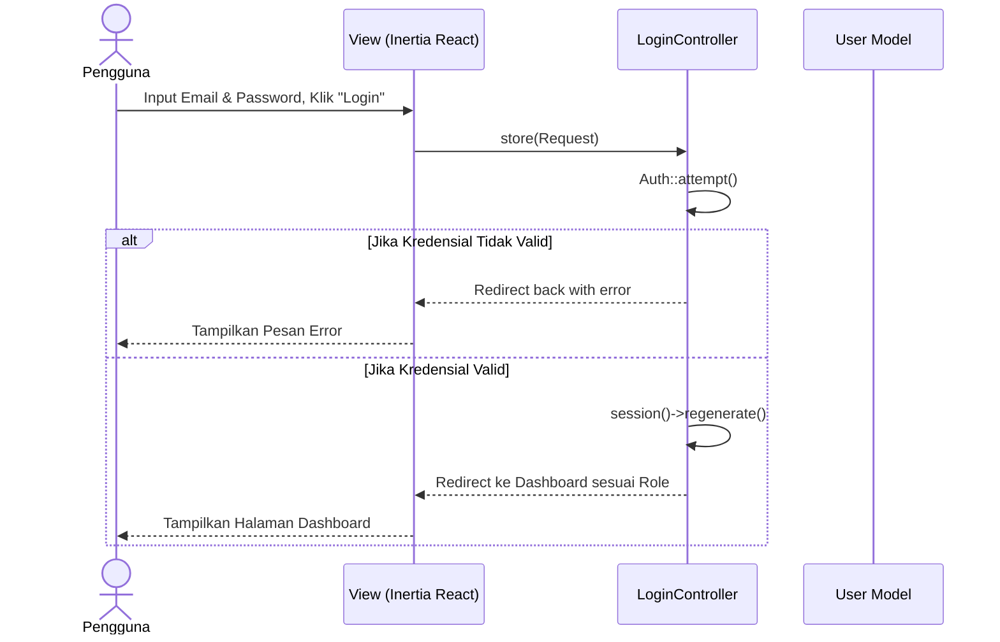

---

### SD-02 — Mengelola Data Master
Proses pengelolaan data master oleh Bagian Umum, termasuk penandaan penghapusan sementara (*soft delete*).

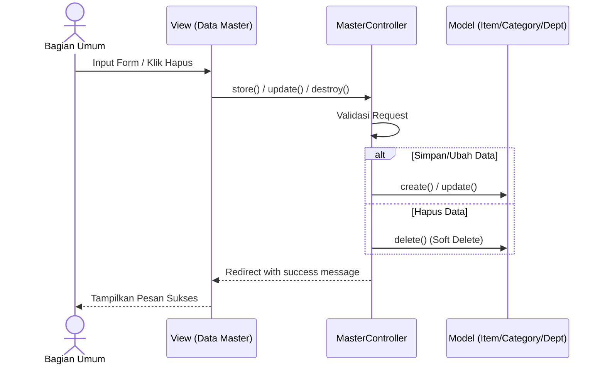

---

### SD-03 — Menginput Barang Masuk
Proses pencatatan barang dari vendor, dengan kewajiban melampirkan bukti transaksi (Nota).

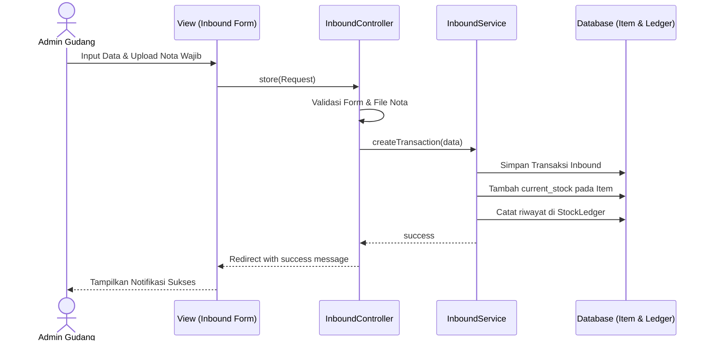

---

### SD-04 — Mengelola Pengguna
Proses pengelolaan akun pengguna. Penghapusan akan dicegah jika pengguna sudah memiliki riwayat transaksi.

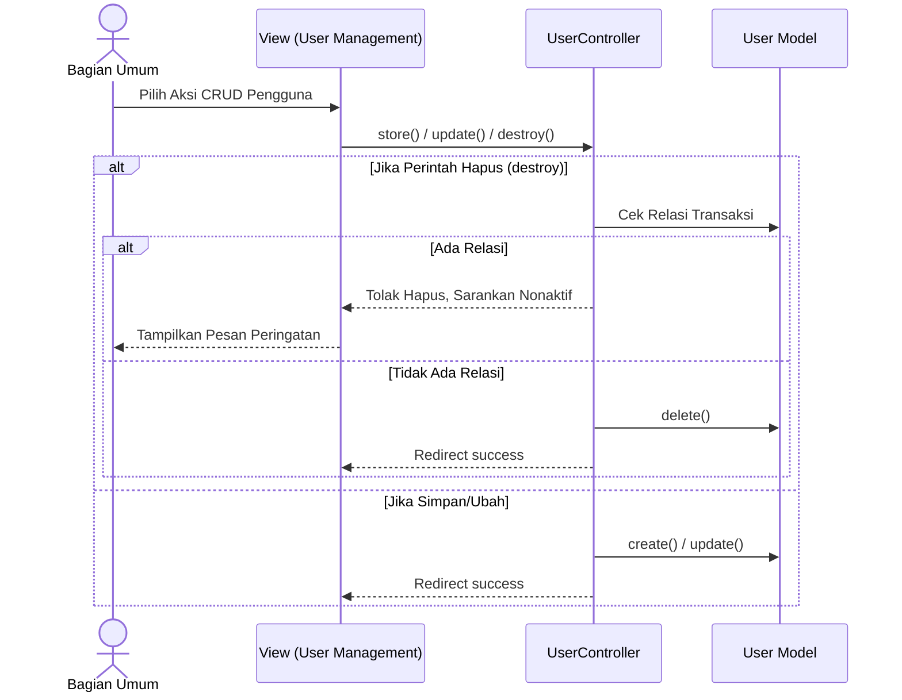

---

### SD-05 — Melihat Audit Trail Digital
Proses melihat log aktivitas beserta detail perubahan data sebelum dan sesudahnya.

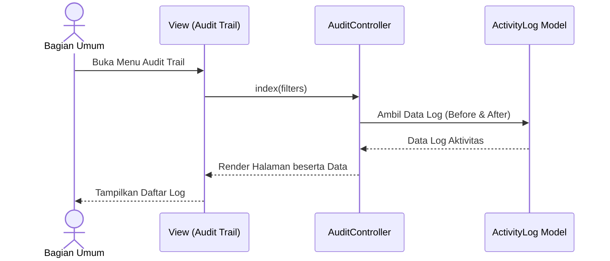

---

### SD-06 — Mengelola Pengaturan Sistem
Proses menyimpan konfigurasi dasar yang menampilkan nilai pengaturan saat ini.

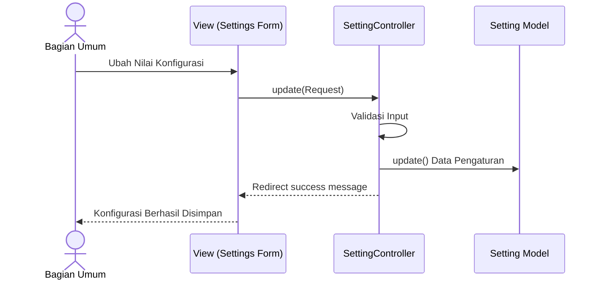

---

### SD-07 — Melihat Laporan & Rekonsiliasi
Proses membuat laporan umum dan melakukan input rekonsiliasi stok fisik versus sistem.

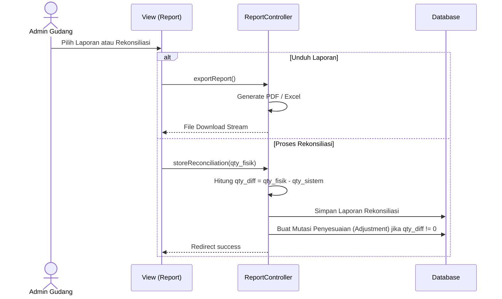

---

### SD-08 — Mengajukan Permintaan Barang
Permintaan barang dari Staff (butuh persetujuan) berbeda dengan Penyelia (otomatis disetujui).

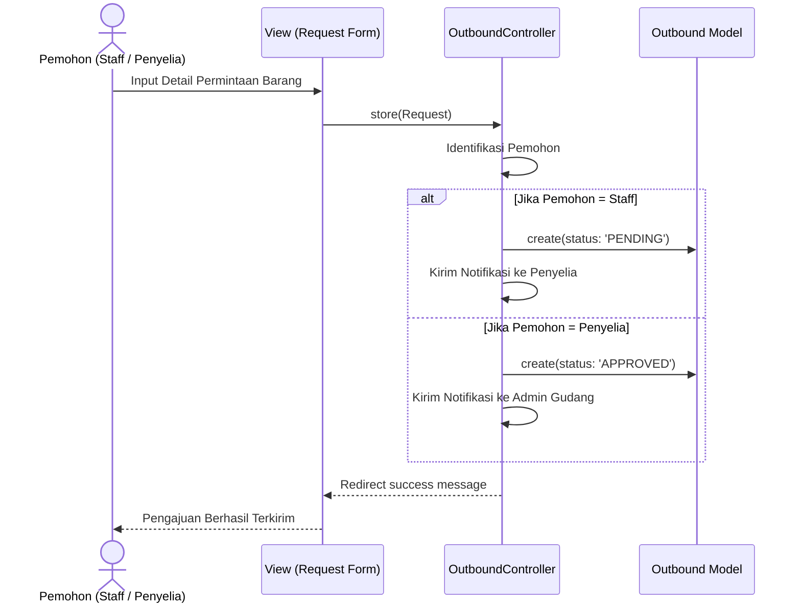

---

### SD-09 — Mengonfirmasi Serah Terima Barang
Proses dua arah: Admin Gudang menyerahkan, kemudian Pemohon mengonfirmasi penerimaan secara fisik.

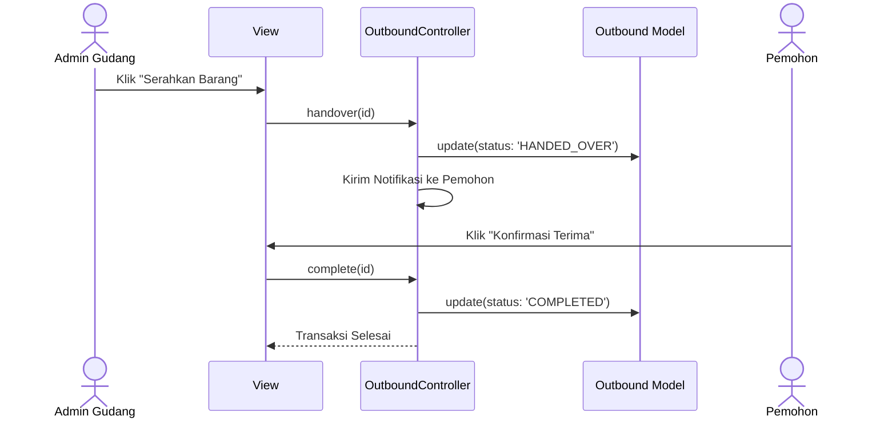

---

### SD-10 — Cetak Dokumen Transaksi
SPB dapat dicetak di awal, tetapi BAST baru bisa dicetak setelah serah terima selesai.

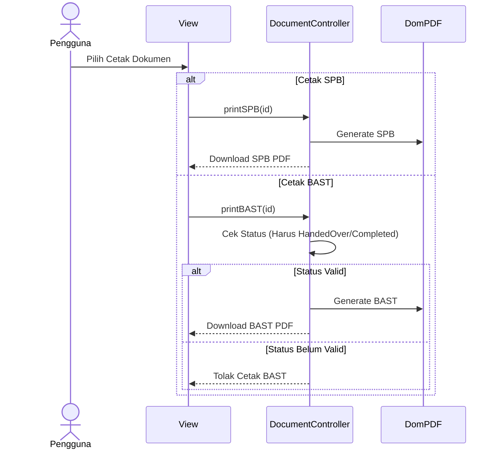

---

### SD-11 — Verifikasi Permintaan Barang
Penyelia melakukan peninjauan terhadap pengajuan dari Staff. Bisa sesuaikan jumlah atau menolak dengan alasan.

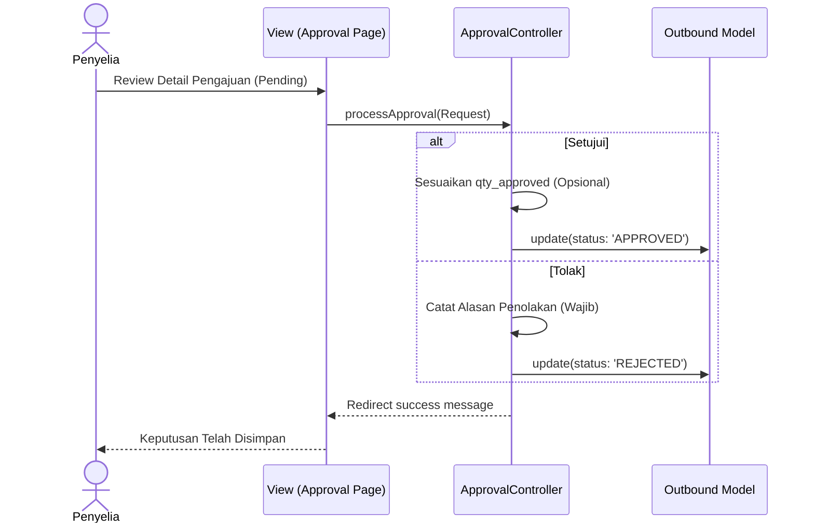

---

### SD-12 — Membuat Permintaan Langsung
Admin gudang mengeluarkan barang tanpa melalui alur verifikasi penyelia (potong stok langsung).

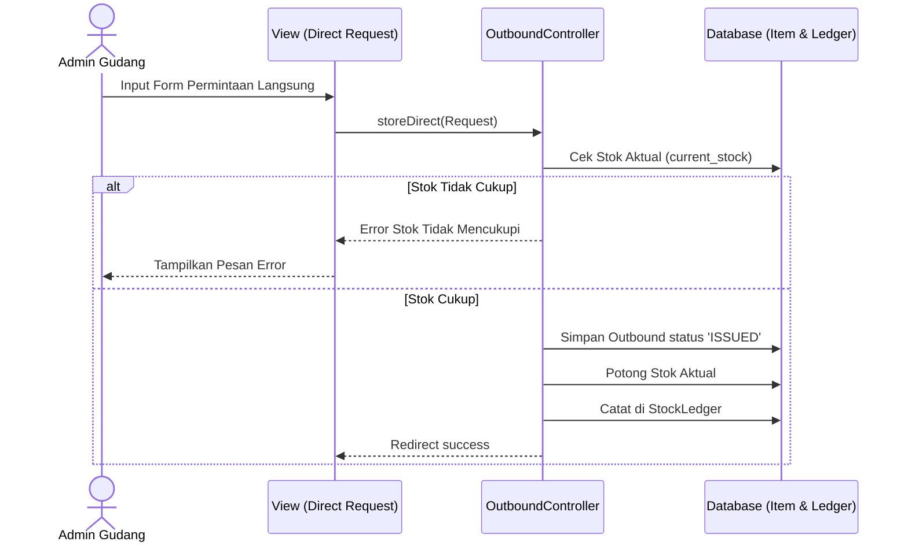

---

### SD-13 — Menyetujui Permintaan Barang
Tindakan Admin Gudang untuk benar-benar mengeluarkan stok dari pengajuan yang sudah disetujui (*Approved*).

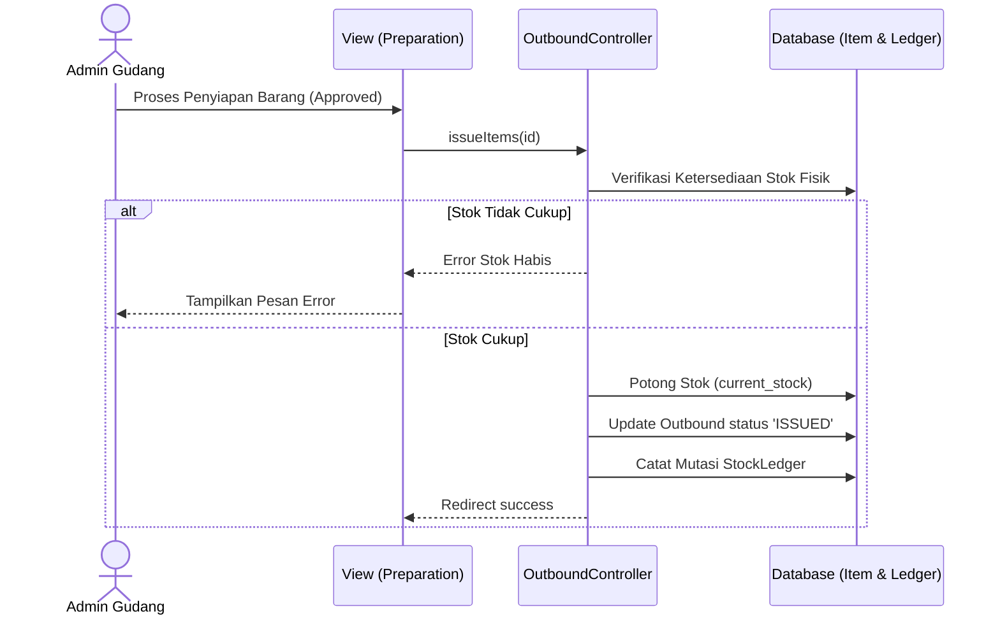

---

### SD-14 — Melihat Data Barang
Pemantauan data stok oleh Admin Gudang dengan ketersediaan fitur filter khusus peringatan stok minim.

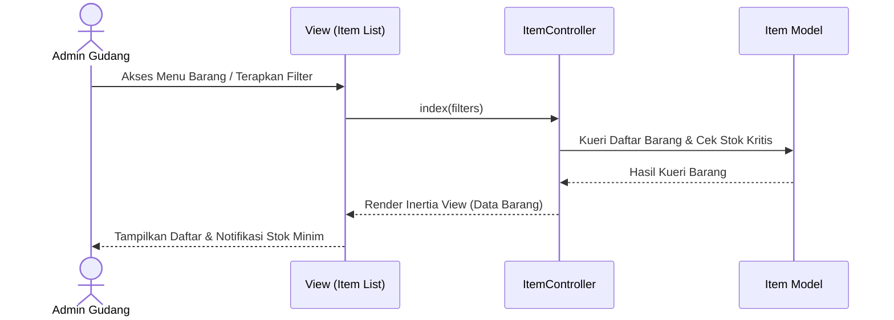

---

## 3. Penutup
Keseluruhan 14 urutan interaksi sistem di atas merepresentasikan bentuk penyederhanaan dari kompleksitas sistem **SIMPATIK** di lapangan, yang difokuskan pada kejelasan aliran instruksi dari aksi Pengguna ke lapisan presentasi (*View*), ke pengendali (*Controller*), dan akhirnya berlabuh pada basis data (*Model/Database*).
