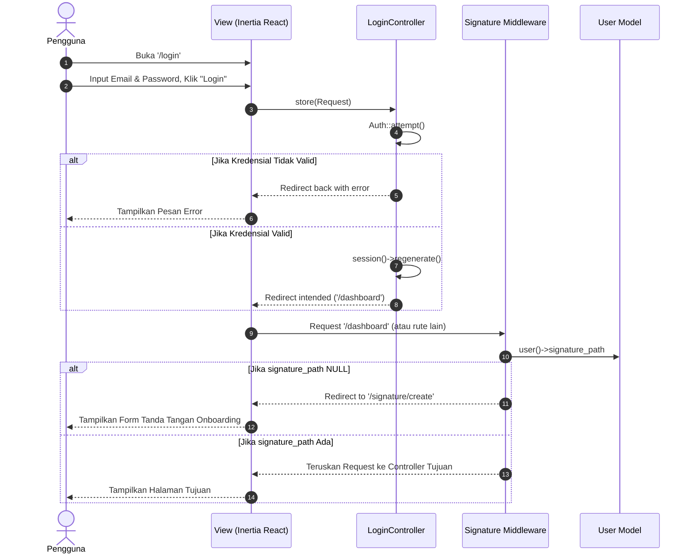
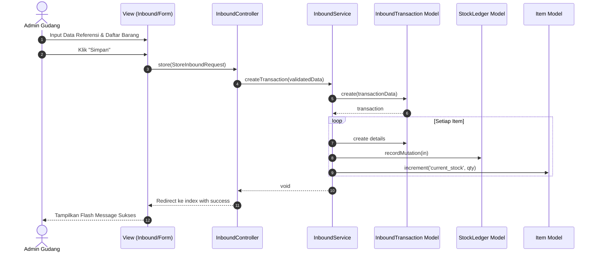
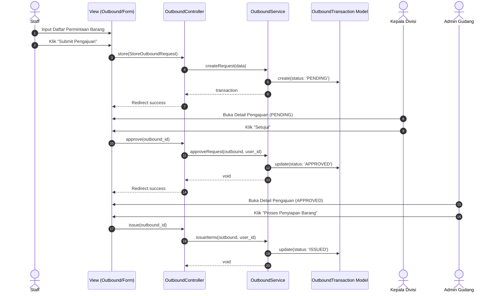
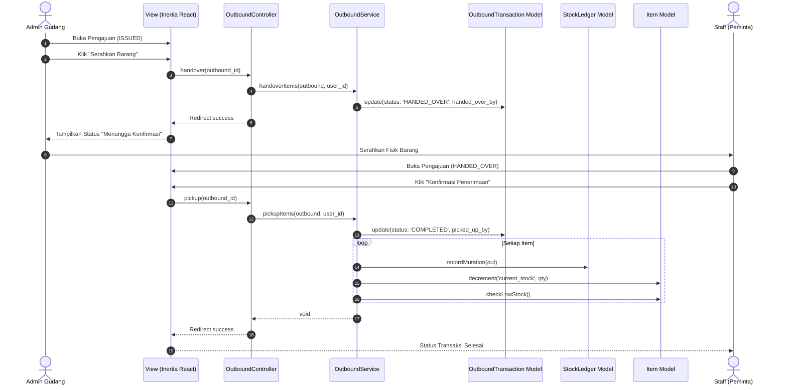
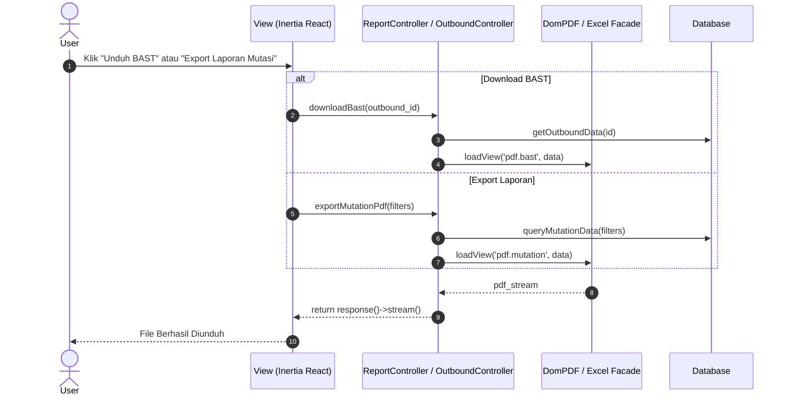
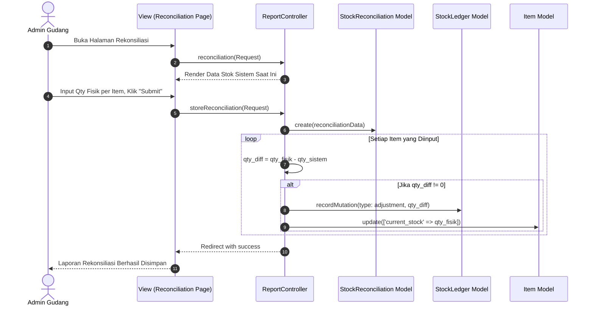
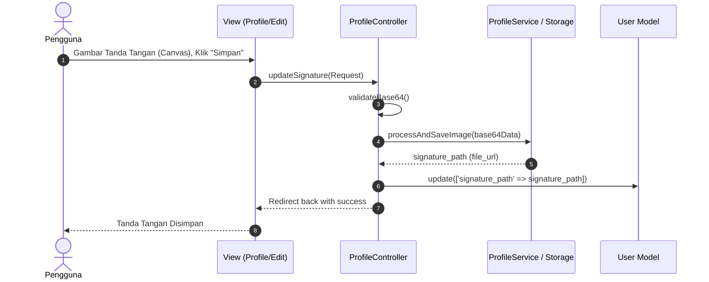
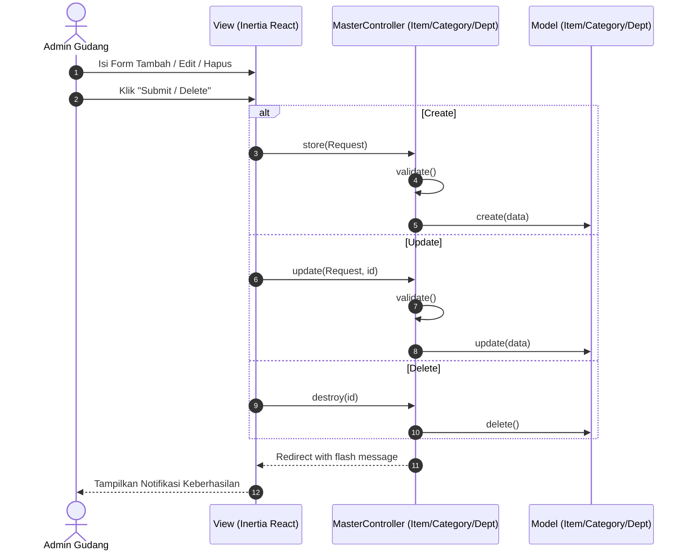

# Laporan Sequence Diagram — SIMPATIK

> **Sistem Manajemen Persediaan ATK**
> PT. Bank Pembangunan Daerah Sumatera Selatan dan Bangka Belitung
> Cabang Utama Kapten A. Rivai, Palembang

---

## 1. Pendahuluan

Sequence Diagram memodelkan urutan pemanggilan *method* dari satu komponen ke komponen lain pada arsitektur perangkat lunak. Pada sistem **SIMPATIK**, Sequence Diagram ini disusun berdasarkan arsitektur riil proyek yang menggunakan **Inertia.js (React)** sebagai *View*, **Laravel Controllers**, **Services** untuk logika bisnis, dan **Eloquent Models**.

---

## 2. Sequence Diagram per Fitur Utama

### 2.1 Proses Autentikasi & Pengecekan Tanda Tangan (*Login & Signature Middleware*)
Proses ini mencakup *login* standar via `LoginController` dan pengecekan kelengkapan tanda tangan oleh *Middleware*.

---

### 2.2 Proses Pemasukan Barang (*Inbound Transaction*)
Proses pencatatan barang masuk oleh Admin Gudang.

---

### 2.3 Proses Pengajuan Barang Normal (*Outbound Transaction - Request & Approval*)
Tahap pengajuan (*Pending*), persetujuan oleh Kepala Divisi (*Approved*), dan penyiapan oleh Admin Gudang (*Issued*).

---

### 2.4 Proses Penyerahan & Konfirmasi Barang (*Outbound - Handover & Pickup*)
Tahap akhir di mana Admin Gudang menyerahkan fisik barang (*Handed Over*) dan Peminta mengonfirmasi penerimaan secara sistem (*Completed*).

---

### 2.5 Pembuatan & Unduh Laporan (*Reporting & BAST PDF*)
Menampilkan interaksi pembuatan laporan (PDF/Excel) menggunakan *DomPDF* / *Excel Exporter* via *Controller* dan *Service*.

---

### 2.6 Proses Rekonsiliasi Stok (*Stock Reconciliation*)
Rekonsiliasi ditangani langsung oleh `ReportController` untuk mengecek stok awal, input fisik aktual, dan melakukan penyesuaian (adjustment).

---

### 2.7 Proses Pengaturan Profil & Tanda Tangan (*Profile Update*)
Bagaimana pengguna menyimpan tanda tangan digital (*signature*) untuk kebutuhan cetak BAST, yang akan ditangani oleh `SignatureController` atau `ProfileController`.

---

### 2.8 Pengelolaan Data Master (*Master Data Management*)
Pola interaksi konvensional untuk *CRUD* Master Data (Barang, Kategori, Departemen) via *Controller*.

---

## 3. Penjelasan Arsitektur Interaksi

Berdasarkan *Sequence Diagram* di atas, arsitektur SIMPATIK menggunakan pola **Inertia.js - Laravel MVC-S**:

1.  **Actor (Pengguna):** Berinteraksi langsung dengan *browser*.
2.  **View (Inertia React):** Dibangun dengan *React.js* yang di-render oleh Inertia. Bertugas menampilkan UI, menangani *state* lokal, dan mengirimkan *HTTP Request* tanpa *page reload* penuh (SPA).
3.  **Controller:** Berfungsi sebagai gerbang masuk dari *View* (melalui *Route*), melakukan validasi dasar via *FormRequest*, mengecek otorisasi pengguna (`Gate::authorize`), dan memanggil *Service* atau *Model*.
4.  **Service:** Kelas (*Service Class* seperti `OutboundService`) yang menampung logika bisnis kompleks, transaksi *database* banyak tabel, dan penanganan kalkulasi stok, agar *Controller* tetap *clean* dan mudah diuji.
5.  **Model (Eloquent):** Bertanggung jawab atas kueri data ke *database*, mutasi struktur, relasi, dan pengelolaan riwayat.
