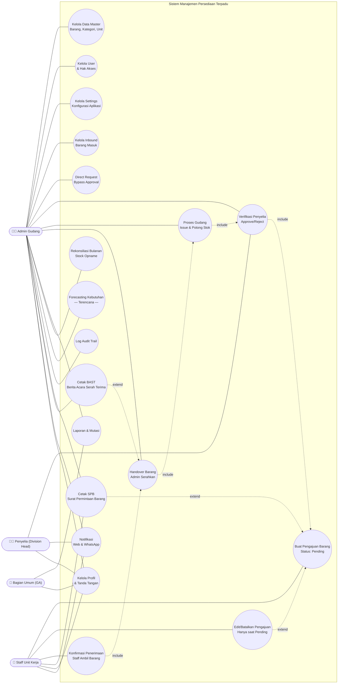
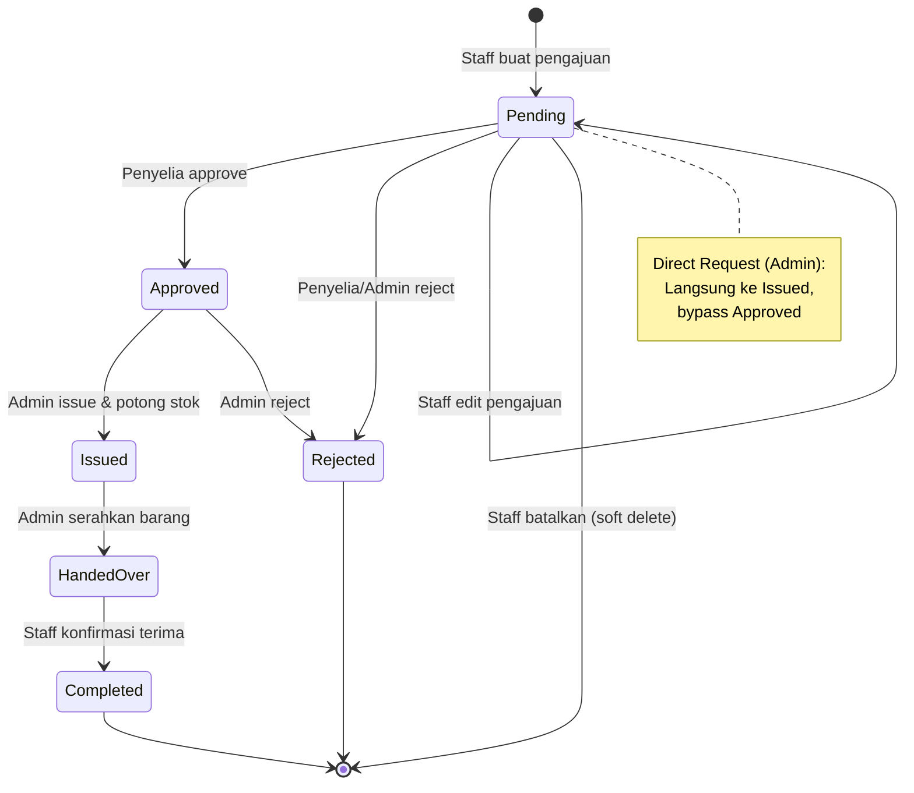

# 1. Analisis Use Case Sistem SIMPATIK (Berdasarkan Kode Sumber)

Use Case Diagram ini disusun berdasarkan hasil riset mendalam terhadap *business logic* di dalam kode sumber SIMPATIK, khususnya pada `OutboundService`, `UserRole`, dan sistem status transaksi.

## 1.1 Identifikasi Aktor & Kewenangan Real

Berdasarkan implementasi di `App\Enums\UserRole.php`, berikut adalah kewenangan aktor yang sebenarnya:

| Aktor | Peran Teknis dalam Kode |
| :--- | :--- |
| **Admin Gudang** | Memiliki akses penuh. Fitur unik: **Direct Request** (bypass approval), **Input Inbound**, **Approve/Reject** pengajuan, **Issue Items** (potong stok), **Handover Items**, **Kelola User**, **Kelola Settings**, dan **Lihat Audit Log**. |
| **Penyelia (Division Head)** | Melakukan **Approval/Rejection** terhadap pengajuan staf di unit kerjanya saja. |
| **Staff Unit Kerja** | Melakukan **Request Outbound**, **Edit/Batalkan Pengajuan** (saat Pending), dan **Pickup Confirmation** (Dual Confirmation). |
| **Bagian Umum (GA)** | Memiliki hak akses baca (**View Reports**, **Export Reports**, **View All Requests**) untuk monitoring. |

## 1.2 Use Case Diagram

Diagram ini mencerminkan alur *State Machine* dari transaksi barang yang ada di `OutboundStatus.php`:

## 1.3 Deskripsi Skenario Utama

Berikut adalah penjelasan fungsi berdasarkan logika program (`OutboundService.php`, `OutboundController.php`, `ReportController.php`, dll):

### 1.3.1 Siklus Outbound (Inti)

| Use Case | Penjelasan Berdasarkan Kode |
| :--- | :--- |
| **Buat Pengajuan** | Staff membuat `OutboundTransaction` dengan status awal *Pending*. Sistem mengirim notifikasi WhatsApp dan Web ke Penyelia di unit kerja yang sama. |
| **Edit/Batalkan Pengajuan** | Pemilik pengajuan dapat mengedit detail atau membatalkan (soft delete) pengajuan selama status masih *Pending*. |
| **Direct Request** | Fitur khusus Admin Gudang untuk mengeluarkan barang secara instan. Sistem langsung mengubah status menjadi *Issued* dan memotong stok tanpa perlu persetujuan Penyelia. |
| **Approve/Reject** | Penyelia memverifikasi permintaan dari unit kerjanya. Jika disetujui, jumlah barang yang disetujui dicatat (`quantity_approved`). Admin Gudang juga dapat menolak pengajuan dari status *Pending* maupun *Approved*. |
| **Issue & Potong Stok** | Admin Gudang memproses pengeluaran barang. Sistem melakukan *pessimistic locking* pada tabel barang dan mengurangi stok fisik di database. Jika stok di bawah threshold, notifikasi *Low Stock Alert* dikirim otomatis. |
| **Handover & Pickup** | **Dual Confirmation**: Admin menandai barang telah diserahkan (`HandedOver`), lalu Staff harus mengonfirmasi penerimaan (`Completed`) agar siklus transaksi selesai. |

### 1.3.2 Modul Dokumen

| Use Case | Penjelasan Berdasarkan Kode |
| :--- | :--- |
| **Cetak SPB** | Generate PDF *Surat Permintaan Barang* lengkap dengan QR Code yang mengarah ke detail pengajuan. |
| **Cetak BAST** | Generate PDF *Berita Acara Serah Terima* setelah barang diserahkan. Tersedia setelah status *HandedOver* atau *Completed*. |

### 1.3.3 Modul Analitik & Laporan

| Use Case | Penjelasan Berdasarkan Kode |
| :--- | :--- |
| **Laporan & Mutasi** | Rekapitulasi mutasi stok bulanan, kartu stok (stock ledger), dan laporan penggunaan per unit kerja. Dapat diekspor ke **PDF** dan **Excel**. |
| **Rekonsiliasi Bulanan** | Stock opname: membandingkan stok sistem vs stok fisik dan menyimpan catatan selisih per item. |
| **Forecasting** | *(Terencana)* Menggunakan data historis dari *Stock Ledger* untuk memprediksi kebutuhan barang. Model `DemandForecast` dan permission `view-forecasting` sudah tersedia, menunggu implementasi controller dan service. |
| **Log Audit Trail** | Mencatat seluruh aktivitas pengguna (siapa, apa, kapan, perubahan apa) dengan diff properties. Hanya Admin Gudang yang dapat mengaksesnya. |

### 1.3.4 Modul Administrasi

| Use Case | Penjelasan Berdasarkan Kode |
| :--- | :--- |
| **Kelola Data Master** | CRUD untuk Barang (`ItemController`), Kategori (`CategoryController`), dan Unit Kerja (`DepartmentController`). |
| **Kelola Inbound** | Pencatatan barang masuk oleh Admin Gudang. Stok otomatis bertambah saat disimpan dan rollback saat dihapus. |
| **Kelola User** | Admin Gudang mengelola akun pengguna: CRUD dan toggle aktif/nonaktif. |
| **Kelola Settings** | Konfigurasi aplikasi termasuk endpoint API untuk integrasi ML/Forecasting. |
| **Notifikasi** | Dual-channel: Web (database) dan WhatsApp Gateway. Meliputi notifikasi pengajuan baru, perubahan status, barang siap diambil, dan alert stok rendah. |
| **Kelola Profil & Tanda Tangan** | Setiap user wajib memiliki tanda tangan digital (*signature onboarding*) sebelum mengakses fitur utama. Profil dan password juga dapat diubah. |

## 1.4 State Machine: Alur Status Pengajuan

---

**Validasi terhadap Kode:**
- Aktor **Division Head** divalidasi melalui `UserRole::DIVISION_HEAD`.
- Alur **Pending → Approved → Issued → HandedOver → Completed** divalidasi melalui `OutboundStatus.php`.
- Fitur **Direct Request** divalidasi melalui function `createDirectRequest` di `OutboundService.php`.
- Fitur **Reject dari Approved** divalidasi melalui function `rejectRequest` di `OutboundService.php`.
- Fitur **Dual Confirmation** divalidasi melalui `handoverItems` dan `pickupItems` di `OutboundService.php` serta `OutboundPolicy.php`.
- Fitur **SPB/BAST PDF** divalidasi melalui `downloadSpb` dan `downloadBast` di `OutboundController.php`.
- Fitur **Rekonsiliasi** divalidasi melalui `reconciliation` dan `storeReconciliation` di `ReportController.php`.
- Fitur **Audit Trail** divalidasi melalui `ActivityLogController.php` dan model `ActivityLog.php`.
- Fitur **Notifikasi WhatsApp** divalidasi melalui `WhatsAppChannel.php` dan 4 class Notification.
- Fitur **Signature Onboarding** divalidasi melalui middleware `signature` dan `SignatureController.php`.
