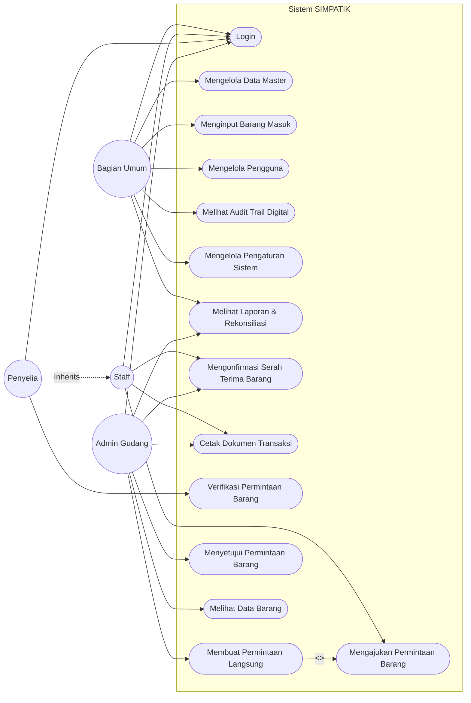

# Laporan Use Case Sistem SIMPATIK

## 1. Daftar Aktor
Sistem SIMPATIK memiliki 4 aktor utama, dengan aturan generalisasi:
- **Bagian Umum**
- **Admin Gudang**
- **Staff**
- **Penyelia** *(mewarisi seluruh hak akses dan use case dari Staff)*

## 2. Pemetaan Use Case per Aktor

### Bagian Umum
1. Login
2. Mengelola Data Master
3. Menginput Barang Masuk
4. Mengelola Pengguna
5. Melihat Audit Trail Digital
6. Mengelola Pengaturan Sistem
7. Melihat Laporan & Rekonsiliasi

### Staff
1. Login
2. Mengajukan Permintaan Barang
3. Mengonfirmasi Serah Terima Barang
4. Cetak Dokumen Transaksi

### Penyelia
1. Login
2. Verifikasi Permintaan Barang

### Admin Gudang
1. Login
2. Membuat Permintaan Langsung
3. Menyetujui Permintaan Barang
4. Mengonfirmasi Serah Terima Barang
5. Cetak Dokumen Transaksi
6. Melihat Laporan & Rekonsiliasi
7. Melihat Data Barang

## 3. Relasi Use Case
- **Extend:** `Membuat Permintaan Langsung` **-->** `Mengajukan Permintaan Barang`
  *(Membuat Permintaan Langsung merupakan proses khusus yang melewati/bypass tahap verifikasi Penyelia).*

## 4. Alur Kerja (Workflow) Utama
1. **Staff** mengajukan permintaan barang.
2. **Penyelia** melakukan verifikasi permintaan barang.
3. Setelah diverifikasi, **Admin Gudang** menyetujui permintaan barang.
4. Barang diserahkan oleh bagian gudang.
5. **Staff** dan **Admin Gudang** melakukan konfirmasi serah terima barang.

## 5. Aturan Khusus (Business Rules)
- **Otentikasi:** `Login` merupakan prasyarat mutlak sebelum aktor dapat mengakses seluruh fitur sistem.
- **Hak Akses:** Penyelia mewarisi seluruh hak akses Staff (Generalization).
- **Jalur Khusus:** Use Case `Membuat Permintaan Langsung` oleh Admin Gudang akan memotong alur standar dengan melewati proses verifikasi Penyelia.

## 6. Diagram Use Case

